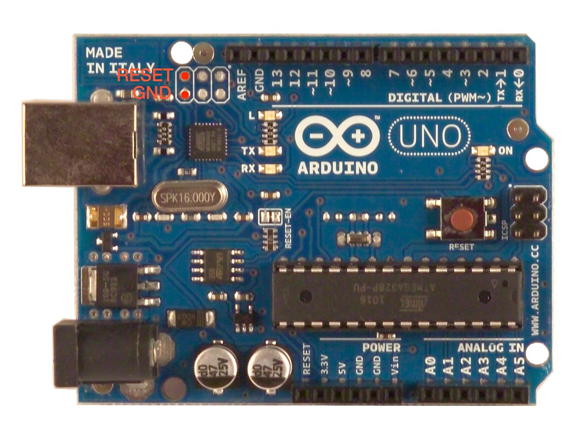

# 簡介
- 這篇內容將帶領大家把Arduino手把變成電腦手把

# 所需硬體
- Arduino Uno R3 * 1
- JoyStick 雙軸按鍵搖桿模組 * 1

# 下載檔案
- [FLIP](https://www.microchip.com/DevelopmentTools/ProductDetails/PartNO/FLIP) － 請下載包含JRE的檔案(Java Runtime Environment included)
- [UnoJoy](https://github.com/AlanChatham/UnoJoy) － 將Uno變成電腦手把
- [x360ce](https://www.x360ce.com/) － 將手把模擬成xbox 360的手把

# 教學開始
1. 將下載好的FLIP安裝至電腦
2. 確定電腦已安裝Arduino IDE，並已連接Uno板至電腦，可在裝置管理員查看狀態（如下圖）

3. 打開剛剛下載的UnoJoy資料夾下的檔案，並將它上傳進Uno板中 `UnoJoy-master\UnoJoy\UnoJoyArduinoSample\UnoJoyArduinoSample.ino`
4. 關閉Arduino IDE，進入DFU Mode，進入方式：用導線同時接觸下圖框起處的兩根針腳

5. 確認已進入 DFU Mode，如下圖

    - 若找不到驅動可手動新增驅動，選擇資料夾為 `C:\Program Files (x86)\Atmel\Flip 3.4.7\usb`
6. 打開UnoJoy資料夾，啟動TurnIntoAJoystick的批次檔，檔案路徑 `UnoJoy-master\UnoJoy\TurnIntoAJoystick.bat`，執行成功結果如下圖

7. 至此已完成將Uno變成電腦搖桿，之後插上Uno板皆為UnoJoy Joystick，可在以下路徑查看 `控制台\硬體和音效\裝置和印表機`
8. 將搖桿的vrx和vry分別連接至Uno板的A0和A1，在 `控制台\硬體和音效\裝置和印表機` 裡的UnoJoy Joystick圖示上右鍵->遊戲控制器->內容，可查看搖桿狀態，如下圖

9. 最後進入起動x360ce，新建立一個搖桿的設定檔，並選取模擬的位置，點選[Record]，依圖示移動搖桿方向即設定完成

# 補充
- 如何將UnoJoy Joystick變回一般的Arduino Uno板
    1. 連接UnoJoy Joystick，並進入DFU Mode
    2. 打開UnoJoy資料夾，啟動TurnIntoAnArduino的批次檔，檔案路徑 `UnoJoy-master\UnoJoy\TurnIntoAnArduino.bat`
    3. 將Uno的usb重新接上電腦，即可看到已變回
- 如果UnoJoy檔案下載太慢，可至 [這裡](https://code.google.com/archive/p/unojoy/) 下載，但此載點內容僅包含uno板的檔案（Github的檔案裡包含其他板子變成手把的檔案，故檔案相對較大）
- 如何在電腦遊戲中使用此手把
    - 將剛剛x360ce創建的兩個檔案（x360ce.ini/xinput.dll）放進遊戲資料夾的根目錄即可
- 此範例檔案預設搖桿資訊
    - A0~A1 － 為左搖桿的x，y
    - A2~A3 － 為右搖桿的x，y
    - D2~D5 － 為PS搖桿的右側功能鍵
    - D6~D9 － 為PS搖桿的左側方向鍵
    - D10~D11 － 為PS搖桿的L1R1
    - D12 － select
    - A4 － start
    - A5 － home
    - 但由於是模擬成xbox的手把，故可自由接線，再由x360ce中直接[Record]即可
    - 若是腳位不夠可自行替換成mega板