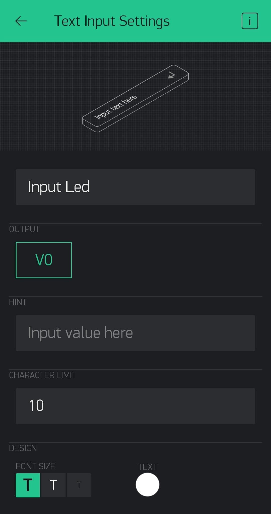
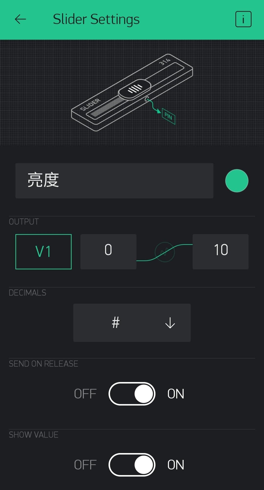
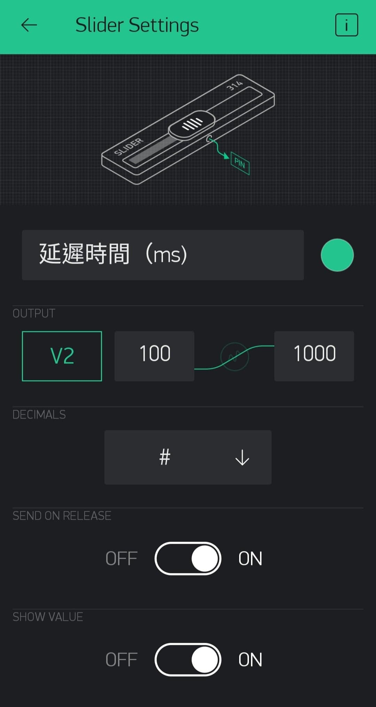

# 簡介
- 這篇內容將帶領大家製作點陣跑馬燈，並且用Blynk來操控它

# 硬體
- WeMos D1R2 * 1
- MAX7219 8*8LED點陣模組 * 2

# 下載
- 至手機應用商店下載Blynk的App－[Blynk官網](https://blynk.io/https://blynk.io/)
- 下載Blynk函式庫
- [maxmatrix](https://code.google.com/archive/p/arudino-maxmatrix-library/)－下載並加入函式庫

# 教學開始
## 連接腳位
|MAX7219|D1R2|
|----|----|
|VCC|5V|
|GND|GND|
|DIN|MOSI/D7|
|CS|SS/D8|
|CLK|SCK/D5|
- 若要串聯多塊MAX7219的話，請將下一塊的DIN接至上一塊的DOUT連接腳位

## 設定Blynk
- 請照下圖拉出三個物件，並設定其相關參數



## D1R2程式碼
```cpp
#include <MaxMatrix.h>
#include <avr/pgmspace.h>
#include <ESP8266WiFi.h>
#include <BlynkSimpleEsp8266.h>

char auth[] = "Blynk auth";
char ssid[] = "Wifi ssid";
char pass[] = "Wifi password";

PROGMEM const unsigned char CH[] = {
    3, 8, B0000000, B0000000, B0000000, B0000000, B0000000, // space
    1, 8, B1011111, B0000000, B0000000, B0000000, B0000000, // !
    3, 8, B0000011, B0000000, B0000011, B0000000, B0000000, // "
    5, 8, B0010100, B0111110, B0010100, B0111110, B0010100, // #
    4, 8, B0100100, B1101010, B0101011, B0010010, B0000000, // $
    5, 8, B1100011, B0010011, B0001000, B1100100, B1100011, // %
    5, 8, B0110110, B1001001, B1010110, B0100000, B1010000, // &
    1, 8, B0000011, B0000000, B0000000, B0000000, B0000000, // '
    3, 8, B0011100, B0100010, B1000001, B0000000, B0000000, // (
    3, 8, B1000001, B0100010, B0011100, B0000000, B0000000, // )
    5, 8, B0101000, B0011000, B0001110, B0011000, B0101000, // *
    5, 8, B0001000, B0001000, B0111110, B0001000, B0001000, // +
    2, 8, B10110000, B1110000, B0000000, B0000000, B0000000, // ,
    4, 8, B0001000, B0001000, B0001000, B0001000, B0000000, // -
    2, 8, B1100000, B1100000, B0000000, B0000000, B0000000, // .
    4, 8, B1100000, B0011000, B0000110, B0000001, B0000000, // /
    4, 8, B0111110, B1000001, B1000001, B0111110, B0000000, // 0
    3, 8, B1000010, B1111111, B1000000, B0000000, B0000000, // 1
    4, 8, B1100010, B1010001, B1001001, B1000110, B0000000, // 2
    4, 8, B0100010, B1000001, B1001001, B0110110, B0000000, // 3
    4, 8, B0011000, B0010100, B0010010, B1111111, B0000000, // 4
    4, 8, B0100111, B1000101, B1000101, B0111001, B0000000, // 5
    4, 8, B0111110, B1001001, B1001001, B0110000, B0000000, // 6
    4, 8, B1100001, B0010001, B0001001, B0000111, B0000000, // 7
    4, 8, B0110110, B1001001, B1001001, B0110110, B0000000, // 8
    4, 8, B0000110, B1001001, B1001001, B0111110, B0000000, // 9
    2, 8, B01010000, B0000000, B0000000, B0000000, B0000000, // :
    2, 8, B10000000, B01010000, B0000000, B0000000, B0000000, // ;
    3, 8, B0010000, B0101000, B1000100, B0000000, B0000000, // < 
    3, 8, B0010100, B0010100, B0010100, B0000000, B0000000, // =
    3, 8, B1000100, B0101000, B0010000, B0000000, B0000000, // >
    4, 8, B0000010, B1011001, B0001001, B0000110, B0000000, // ?
    5, 8, B0111110, B1001001, B1010101, B1011101, B0001110, // @
    4, 8, B1111110, B0010001, B0010001, B1111110, B0000000, // A
    4, 8, B1111111, B1001001, B1001001, B0110110, B0000000, // B
    4, 8, B0111110, B1000001, B1000001, B0100010, B0000000, // C
    4, 8, B1111111, B1000001, B1000001, B0111110, B0000000, // D
    4, 8, B1111111, B1001001, B1001001, B1000001, B0000000, // E
    4, 8, B1111111, B0001001, B0001001, B0000001, B0000000, // F
    4, 8, B0111110, B1000001, B1001001, B1111010, B0000000, // G
    4, 8, B1111111, B0001000, B0001000, B1111111, B0000000, // H
    3, 8, B1000001, B1111111, B1000001, B0000000, B0000000, // I
    4, 8, B0110000, B1000000, B1000001, B0111111, B0000000, // J
    4, 8, B1111111, B0001000, B0010100, B1100011, B0000000, // K
    4, 8, B1111111, B1000000, B1000000, B1000000, B0000000, // L
    5, 8, B1111111, B0000010, B0001100, B0000010, B1111111, // M
    5, 8, B1111111, B0000100, B0001000, B0010000, B1111111, // N
    4, 8, B0111110, B1000001, B1000001, B0111110, B0000000, // O
    4, 8, B1111111, B0001001, B0001001, B0000110, B0000000, // P
    4, 8, B0111110, B1000001, B1000001, B10111110, B0000000, // Q
    4, 8, B1111111, B0001001, B0001001, B1110110, B0000000, // R
    4, 8, B1000110, B1001001, B1001001, B0110010, B0000000, // S
    5, 8, B0000001, B0000001, B1111111, B0000001, B0000001, // T
    4, 8, B0111111, B1000000, B1000000, B0111111, B0000000, // U
    5, 8, B0001111, B0110000, B1000000, B0110000, B0001111, // V
    5, 8, B0111111, B1000000, B0111000, B1000000, B0111111, // W
    5, 8, B1100011, B0010100, B0001000, B0010100, B1100011, // X
    5, 8, B0000111, B0001000, B1110000, B0001000, B0000111, // Y
    4, 8, B1100001, B1010001, B1001001, B1000111, B0000000, // Z
    2, 8, B1111111, B1000001, B0000000, B0000000, B0000000, // [
    4, 8, B0000001, B0000110, B0011000, B1100000, B0000000, // backslash
    2, 8, B1000001, B1111111, B0000000, B0000000, B0000000, // ]
    3, 8, B0000010, B0000001, B0000010, B0000000, B0000000, // hat
    4, 8, B1000000, B1000000, B1000000, B1000000, B0000000, // _
    2, 8, B0000001, B0000010, B0000000, B0000000, B0000000, // `
    4, 8, B0100000, B1010100, B1010100, B1111000, B0000000, // a
    4, 8, B1111111, B1000100, B1000100, B0111000, B0000000, // b
    4, 8, B0111000, B1000100, B1000100, B0101000, B0000000, // c
    4, 8, B0111000, B1000100, B1000100, B1111111, B0000000, // d
    4, 8, B0111000, B1010100, B1010100, B0011000, B0000000, // e
    3, 8, B0000100, B1111110, B0000101, B0000000, B0000000, // f
    4, 8, B10011000, B10100100, B10100100, B01111000, B0000000, // g
    4, 8, B1111111, B0000100, B0000100, B1111000, B0000000, // h
    3, 8, B1000100, B1111101, B1000000, B0000000, B0000000, // i
    4, 8, B1000000, B10000000, B10000100, B1111101, B0000000, // j
    4, 8, B1111111, B0010000, B0101000, B1000100, B0000000, // k
    3, 8, B1000001, B1111111, B1000000, B0000000, B0000000, // l
    5, 8, B1111100, B0000100, B1111100, B0000100, B1111000, // m
    4, 8, B1111100, B0000100, B0000100, B1111000, B0000000, // n
    4, 8, B0111000, B1000100, B1000100, B0111000, B0000000, // o
    4, 8, B11111100, B0100100, B0100100, B0011000, B0000000, // p
    4, 8, B0011000, B0100100, B0100100, B11111100, B0000000, // q
    4, 8, B1111100, B0001000, B0000100, B0000100, B0000000, // r
    4, 8, B1001000, B1010100, B1010100, B0100100, B0000000, // s
    3, 8, B0000100, B0111111, B1000100, B0000000, B0000000, // t
    4, 8, B0111100, B1000000, B1000000, B1111100, B0000000, // u
    5, 8, B0011100, B0100000, B1000000, B0100000, B0011100, // v
    5, 8, B0111100, B1000000, B0111100, B1000000, B0111100, // w
    5, 8, B1000100, B0101000, B0010000, B0101000, B1000100, // x
    4, 8, B10011100, B10100000, B10100000, B1111100, B0000000, // y
    3, 8, B1100100, B1010100, B1001100, B0000000, B0000000, // z
    3, 8, B0001000, B0110110, B1000001, B0000000, B0000000, // {
    1, 8, B1111111, B0000000, B0000000, B0000000, B0000000, // |
    3, 8, B1000001, B0110110, B0001000, B0000000, B0000000, // }
    4, 8, B0001000, B0000100, B0001000, B0000100, B0000000, // ~
};

const byte data = D7;
const byte cs = D8;
const byte clk = D5;
const byte maxInUse = 2; //使用的點陣模塊數量
MaxMatrix m(data, cs, clk, maxInUse);
byte buffer[8];
String str;
int speed = 100; //移動的速度，單位ms
int light = 5;
bool islight = false;

void printChar(char);

BLYNK_WRITE(V0){
    str = param.asStr();
    for(int i=0; i<maxInUse; ++i)
        str+="  ";
}

BLYNK_WRITE(V1){
    light = param.asInt();
    islight = true;
}

BLYNK_WRITE(V2){
    speed = param.asInt();
}

void setup() {
    Serial.begin(115200);
    //Blynk
    Blynk.begin(auth, ssid, pass);
    Blynk.virtualWrite(V1, light);
    Blynk.virtualWrite(V2, speed);
    //8*8 led
    m.init();
    m.setIntensity(light); //點陣模組的亮度
}

void loop() {
    if(Blynk.connected()){
        Blynk.run();
        if(islight){
            m.setIntensity(light);
            islight = false;
        }            
        int len = str.length();
        for(int i=0; i<len; ++i){
            printChar(str[i]);
        }
    }
    else{
        Blynk.begin(auth, ssid, pass);
        Serial.println("Reconnected!");
    }
}

void printChar(char c) {
    if(c<32) return;
    c-=32;
    memcpy_P(buffer, CH+7*c, 7);
    m.writeSprite(32, 0, buffer);
    m.setColumn(32+buffer[0], 0);
    for(int i=0; i<=buffer[0]; ++i){
        delay(speed);
        /*往左位移，第一個參數false，代表不旋轉；
        第二個參數false，代表不清空顯示；若設成true，顯示器將不呈現資料。*/
        m.shiftLeft(false, false);
    }
}
```

# 補充
- 若是覺得Blynk的能量太少，可自行架設 [Server](https://github.com/blynkkk/blynk-server)