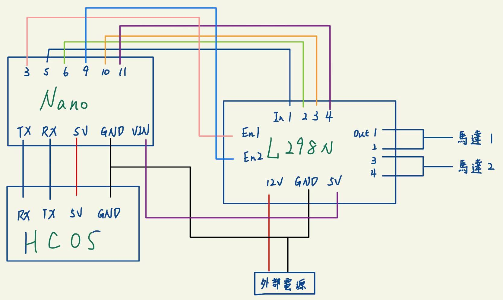
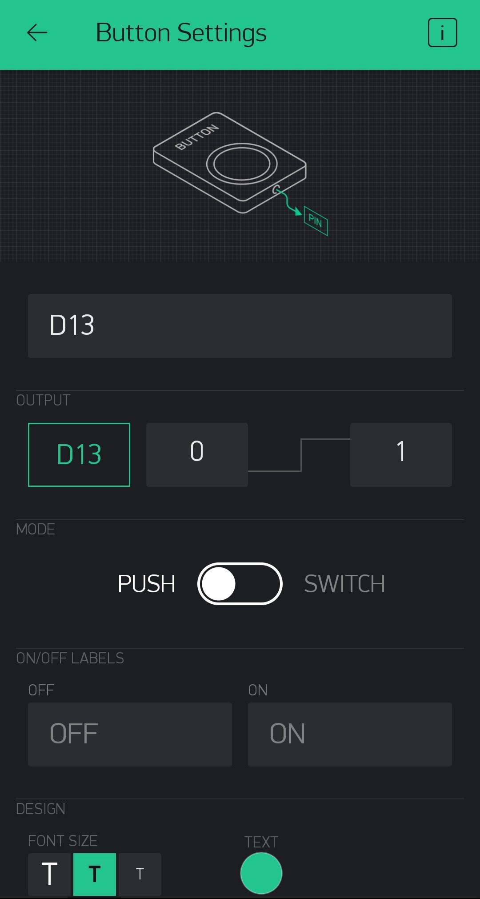
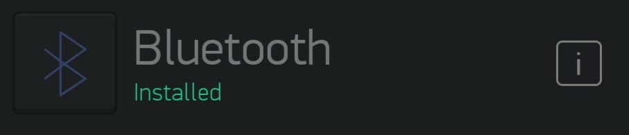
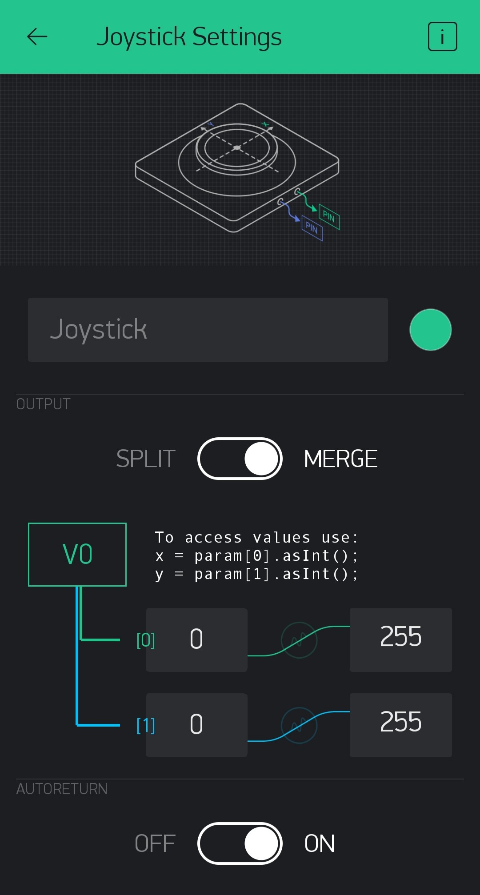

# 簡介
- 這篇內容將帶領大家製作藍芽的遙控車，並且用Blynk的Joystick操控它

# 硬體
- Arduino nano * 1
- L298N 馬達控制板 * 1
- HC-05 藍芽模組 * 1
- 二輪直流馬達遙控車 * 1

# 下載
- 至手機應用商店下載Blynk的App－[Blynk官網](https://blynk.io/)
- 下載Blynk函式庫

# 教學開始
1. 先上傳程式碼至Nano板中
2. 依照下方圖示連接腳位，並且設定Blynk App內的物件

## 連接腳位


## 設定Blynk
- 創建3個元件，分別為Button、Bluetooth、Joystick，並且依下圖進行設置



## nano程式碼
```cpp
#include <BlynkSimpleSerialBLE.h>
#define BLYNK_USE_DIRECT_CONNECT

char auth[] = "Blynk Auth";
int d[2] = {0}; 
int car[2][2] = { {5, 6}, {11, 10} }; //in 1,2,4,3
int en[2] = {3, 9};

void Controller();
void Move(int, int, int, int, int, int);

BLYNK_WRITE(V0){
    for(int i=0; i<2; ++i){
        d[i] = param[i].asInt();
        if(d[i]<=64) d[i] = d[i]*2-255;
        else if(d[i]>64 && d[i]<=192) d[i]=0;
    }
}

void setup() {
    Serial.begin(9600);
    Blynk.begin(Serial, auth);
    for(int i=0; i<2; ++i){
        pinMode(en[i], OUTPUT);
        for(int j=0; j<2; ++j){
            pinMode(car[i][j], OUTPUT);
        }
    }
}

void loop() {
    Blynk.run();
    Controller();
}

void Controller() {
    if(d[0]>0){
        if(d[1]>0) Move(0, 1, 1, 0, min(d[0], d[1]), max(d[0], d[1]));
        else if(d[1]==0) Move(0, 0, 1, 0, 0, d[0]);
        else Move(1, 0, 0, 1, min(d[0], abs(d[1])), max(d[0], abs(d[1])));
    }
    else if(d[0]==0){
        if(d[1]>0) Move(1, 0, 1, 0, d[1], d[1]); 
        else if(d[1]==0) Move(0, 0, 0, 0, 0, 0); 
        else Move(0, 1, 0, 1, abs(d[1]), abs(d[1])); 
    }
    else{
        if(d[1]>0) Move(1, 0, 0, 1, max(abs(d[0]), d[1]), min(abs(d[0]), d[1])); 
        else if(d[1]==0) Move(1, 0, 0, 0, abs(d[0]), 0); 
        else Move(0, 1, 1, 0, max(abs(d[0]), abs(d[1])), min(abs(d[0]), abs(d[1])));
    }
}

void Move(int a1,int a2, int a3, int a4, int e1, int e2) {
    digitalWrite(car[0][0], a1);
    digitalWrite(car[0][1], a2);
    digitalWrite(car[1][0], a3);
    digitalWrite(car[1][1], a4);
    analogWrite(en[0], e1);
    analogWrite(en[1], e2);
}
```
# 補充
- 由於這邊我們將HC-05和Nano板的RX、TX對接，因此自行修改程式碼後要重新上傳時，記得先移除連接Nano板的那兩條線，當然也可使用SoftwareSerial Library來進行，就不用拔除線路了
- 若要自行修改HC-05的設定，可參考下一篇文章 [ARDUINO-05：HC-05 AT命令](../arduino-05)