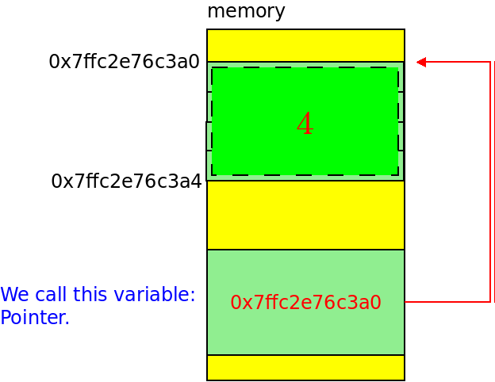
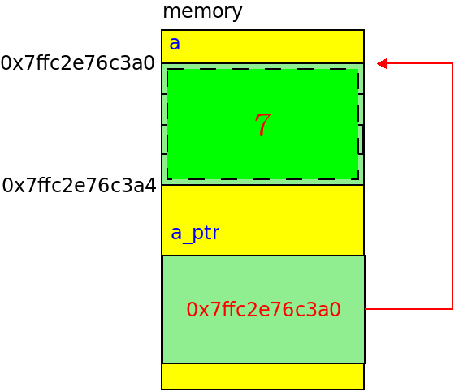
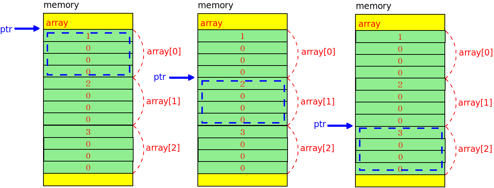
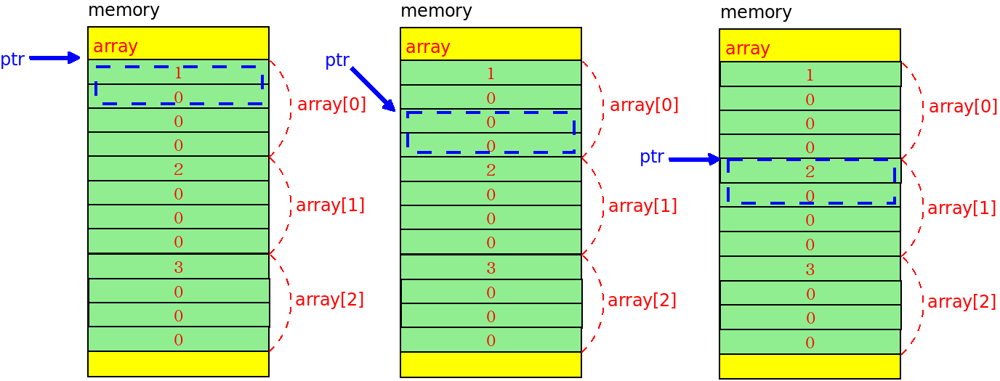
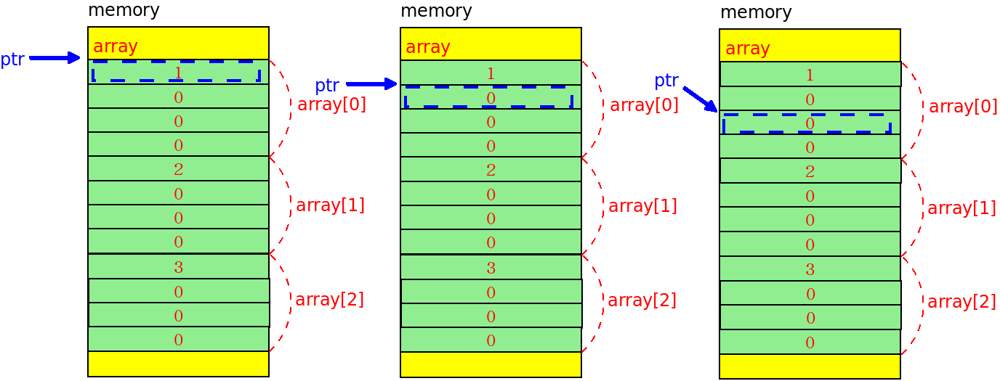
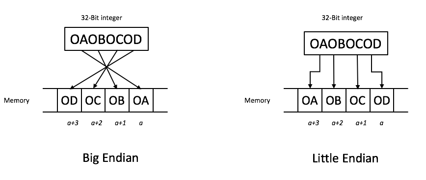
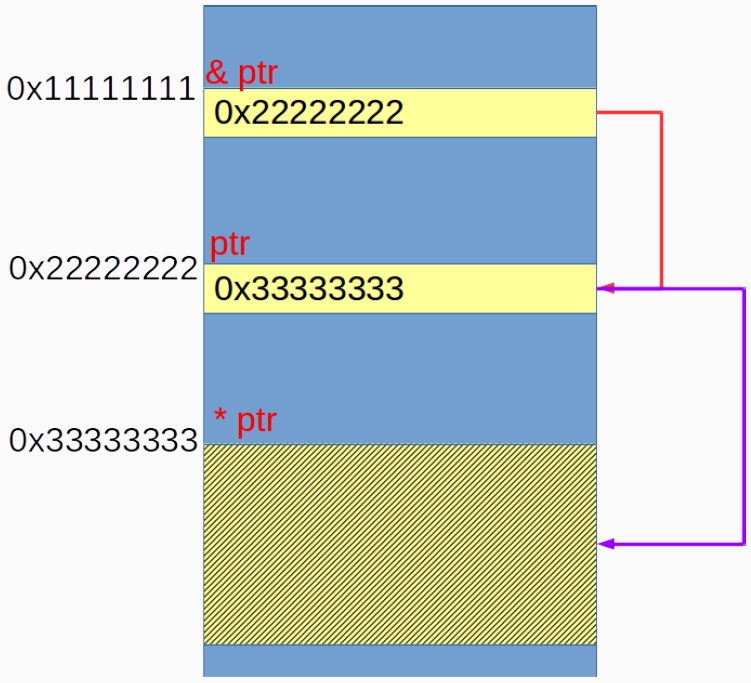

# Pointer
- 許多人不喜歡C是因為有「指標」
- 這可能是C中最困難的一個部分
---
- 指標是一個變數，其值為記憶體位置

- 宣告：`int32_t *p`
    - p 是一個指標
    - 指向的記憶體區塊被視為整數
- 初始化：`int32_t *p = NULL`
- address operator `&`：返回其變數的記憶體位置
    - 如果想要印出記憶體位置，你可以使用`%p`
- indirection operator `*`：也被稱為dereferencing operator，返回指向對象的值

- void *：是一個通用的指標型別(generic pointer type)，可以不透過explicit cast轉換成任意指標的型別

### 傳參數至函式
- 在C語言中，argument passing 稱為 call-by-value
    - 電腦將會分配另一個記憶體區塊
    - 複製輸入的參數到記憶體區塊
    - 函式將會在新的記憶體區塊執行
- 這就是為什麼修改函式中的變數，並不會修改到原本外部的變數了。
- 在C++有另一種傳送方式稱為 call-by-reference，這邊我們不多加介紹。
- 普遍來說，傳址會比傳值更快。

### 陣列與指標
- 在大部分的情況下，我們可以把array視為第一個元素的指標
    - 現在你應該明白為什麼陣列的值會在函式中被修改
- 為了避免模棱兩可(搞混)，我較喜歡`&(array[0])`而不是`array`、`&array`
- 然而你不能寫出 `array = &a`
- int32_t

- int16_t

- int8_t

- `ptr++`
    - 移動的大小是根據指標的型別
    - 這在要讀取每一byte的詳細資料時非常好用
- 事實上，`array[n] = *(ptr + n)`

### Endian Issue


### 函式指標
- 指標不過是一個記憶體位址。
- 當我們宣告某種類型的指標時，這意味著電腦將將訪問記憶體並根據給定的類型解釋存儲在該位址的值。
- 您是否知道函式也存儲在記憶體中？
- 使用函式指標時，返回的型別和參數應該要和實際的定義相同。
    - Really??為什麼在編譯時不會產生errors?
    - 這是個檢查definition的好習慣。
- 回呼函式 (Callback function)
- 你可以用陣列來儲存函式指標
`void (*f[3])(int32_t) = {f1, f2, f3};`
---
- 使用了函式指標的例子
    - Menu Driven
    - Driver
        ```c
        struct file_operations scull_fops = {
            .owner = THIS_MODULE ,
            .llseek = scull_llseek ,
            .read = scull_read ,
            .write = scull_write ,
            .ioctl = scull_ioctl ,
            .open = scull_open ,
            .release = scull_release ,
        };
        ```
    - Firewall
    ```c
    static unsigned int hook_func(
        const struct nf_hook_ops *ops ,
        struct sk_buff *skb ,
        const struct net_device *in ,
        const struct net_device *out ,
        int (*okfn)( struct sk_buff *)
    )
    ```

### 記憶體管理
- 記憶體管理
    - 分配記憶體當你宣告一個變數
    - 垃圾回收 ( GC )
- 為什麼許多現代的程式語言不支援記憶體管理
    - 軟體工程師是人類
    - 人是不可被信任的
- 然而，如果軟體工程師知道他們在做什麼，那麼他們可以更有效率的管理記憶體
- 如果不考慮記憶體，請使用陣列
- 如果你想陣列的大小可以被動態的改變，那麼去讀 C++ 並學習如何使用 container
---
#### malloc
```c
#include <stdlib.h>
ptr = malloc( sizeof(int) * size);
```
- `malloc()` 分配 size bytes 並回傳一個指向所分配的記憶體的指標
- 記憶體沒有初始化
- 若要初始化，請使用 `memset`
```c
#include <string.h>
memset(ptr, 0, sizeof(int) * size);
```
#### calloc
```c
#include <stdlib.h>
ptr = calloc(size, sizeof(int));
```
- 在現代的 C 中，你應該使用 `calloc`
- 第一個參數：多少個區塊你想去分配?
- 第二個參數：每個區塊的大小。
- 記憶體被初始化成 `0`
#### free


- `free(ptr)`：釋放 `ptr` 指向的記憶體空間，該記憶體空間必須是由之前使用 `malloc()、calloc()、realloc()` 所回傳的。
- 此外，若已經 `free(ptr)`，再次使用會發生未定義行為。

### Double Pointer


- 使用場景：
    - 在函式中分配記憶體
    ```c
    #include <stdio.h>
    #include <stdint.h>
    #include <stdlib.h>
    void table(int32_t **pp, int32_t n){
        *pp = (int32_t *)calloc(n * n, sizeof(int32_t));
        for(int32_t i=1; i<=n; ++i){
            for(int32_t j=1; j<=n; ++j){
                *(*pp + (i-1) * n + (j-1)) = i * j;
            }
        }
    }
    int main(){
        int32_t number = 0;
        scanf("%d", number);
        int32_t *ptr = NULL;
        table(&ptr, number);
        return 0;
    }
    ```
    - 分配一個二維陣列
    ```c
    #include <stdio.h>
    #include <stdint.h>
    #include <stdlib.h>
    int main() {
        size_t  size_row = 0, size_column = 0;
        printf("Please enter two integers for row and column: ");
        scanf( "%lu %lu", &size_row, &size_column );
        int32_t **ptr = NULL;
        ptr = (int32_t **)calloc( sizeof( int32_t * ), size_row );
        for( size_t i = 0 ; i < size_row ; i++ ) {
            *( ptr + i ) = (int32_t *)calloc( sizeof( int32_t ), size_column );
            for( size_t j = 0 ; j < size_column ; j++ ) {
                *( *( ptr + i ) + j ) = ( i + 1 ) * ( j + 1 );
            }
        }
        for( size_t i = 0 ; i < size_row ; i++ ) {
            for( size_t j = 0 ; j < size_column; j++ ) {
                printf( "%4d ", *( *( ptr + i ) + j ) );
            }
            printf( "\n" );
        }
        return 0;
    }
    ```
---
### 小工具
#### cdecl
- 安裝：`sudo apt install cdecl`
- 使用：`cdecl` -> `explain int ***a;`
#### 資源查看
- top / htop
- vmstat ( 較輕量化 )
    - `vmstat -n 1` ( `-n 1` 為一秒輸出一次 )