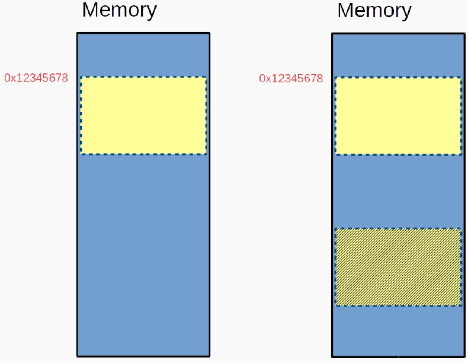
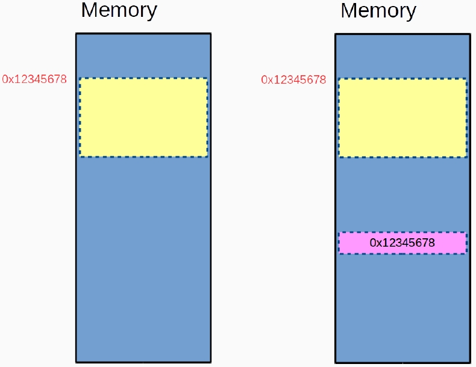

# Structure
- Structures 就是將一堆相關的變數整合在一個名字下。
    - 關鍵字：`struct`
    - 資料型別：`struct _name_`
    - 成員：在 struct 的大括號內宣告的變數。
    - 同一個結構體下的成員名稱是唯一的。
    ```c
    struct _sCard{
        uint8_t suit, face;
    };
    ```
- 初始化
    ```c
    struct _sCard a_card = {.suit = 1, .face = 2};
    struct _sCard a_card = {1, 2};
    ```
- structure member operator -> `.`
- structure pointer operator -> `->`
    ```c
    a_card_ptr = &a_card;
    a_card_ptr->face = 5;
    // Equivalent to
    (*a_card_ptr).face = 5;
    ```
## CPU Alignment
- CPU 有時候會為了減少從記憶體呼叫變數的次數，而主動將變數的記憶體放在連續的地方。
- 為了避免 alignment，你可以使用以下兩種方法：
    - `__attribute__((packed))`
    - pragma
        ```c
        #pragma pack(push)
        #pragma pack(1)
        #pragma pack(pop)
        ```
    ```c
    // 法一
    struct st{
        ...
    }__attribute__((packed));
    // 法二
    #pragma pack(push)
    #pragma pack(1)
    struct st{
        ...
    };
    #pragma pack(pop)
    ```
- Structure 不能包含自己，如果需要請用 pointer !
    ```c
    struct student {
        char name [64];
        uint8_t age;
        uint8_t gender;
        struct student *leader;
    };
    ```
## typedef
- 由於軟體開發者盡可能的保持懶惰，因此他們嘗試縮短程式碼。
- 為了提高可讀性
```c
typedef struct card Card;
typedef struct card {
    uint8_t suit;
    uint8_t face;
} Card;
```
## Structure With Functions
- 為什麼我們時常以傳址的方式傳送 Structures ?
    - 因為效率
- 傳值 vs 傳址
 

## const
```c
int *a; // declare a as pointer to int
int const *a; // syntax error
int * const a; // declare a as const pointer to int
int const * const a; // syntax error
const int *a; // declare a as pointer to const int
const int * const a; // declare a as const pointer to const int
```
- Although C and C++ read mostly from top-to-bottom and left-to-right, pointer declarations read, in a sense, backwards.

# Union
- Union 是所有成員共享相同記憶體空間的派生數據類型。
- 記憶體大小足以容納最大的成員。
- 實際應用
```c
struct ip_addr {
    uint8_t fam; // socket family type
    union {
        struct in_addr ipv4_sin_addr;
        struct in6_addr ipv6_sin_addr;
    }addr;
};
```
## Bitwise Operation
- `&`：AND -> 0&0 = 0; 0&1 = 0; 1&0 = 0; 1&1 = 1.
- `|`：OR -> 0|0 = 0; 0|1 = 1; 1|0 = 1; 1|1 = 1.
- `^`：XOR -> 0^0 = 0; 0^1 = 1; 1^0 = 1; 1^1 = 0.
- `~`：Complement -> \\(\text{\textasciitilde}4_{10}\\) = \\(\text{\textasciitilde}100_2\\) = \\(011_2\\) = \\(3_{10}\\).
- `<<`：Left Shift 0012 << 2 = 1002.
- `>>`：Right Shift 1002 >> 2 = 0012.
---
- 為什麼我們需要 bitwise operation ?
    - 在大多數情況下，按位運算比算術運算要快。
        - a = a * 2
        - a = a << 1
    - 由於編譯器優化，這可能不是正確的。
- Mask with better memory utilization.
- Game Cheating Example
    - ０１ ⽕炎術 １０ 電擊術
    - ０２ 烈炎術 ２０ 落雷術
    - ０４ 炎⿓術 ４０ 轟雷術
    - ０８ 天⽕術 ８０ 神雷術
## Bit Fields
```c
typedef union {
    struct {
        unsigned char b1:1;
        unsigned char b2:1;
        unsigned char b3:1;
        unsigned char b4:1;
        unsigned char b5:1;
        unsigned char b6:1;
        unsigned char b7:1;
        unsigned char b8:1;
    } bits;
    unsigned char byte;
} uByte;
```
- 由於 alignment 問題，記憶體的空間可能不是安全的，這取決於你如何儲存你的資料。
- 實際上，bit fields 可能會增加編程時的難度。我不建議您使用此功能，但是，您需要了解此語法，因為其他人可能會使用它。
- Do not take the address of a bit field.

# Enumeration
- A set of integer enumeration constants represented by identifiers.
```c
enum career {
    SABER, LANCER, ARCHER,
    RIDER, CASTER, ASSASSIN,
    BERSAKER, RULER,
    CAREER_MAX = 31
};
typedef struct player {
    char        name[64];
    enum career role;
    uint32_t    role2;
} Player;
```
- 你不能改變 enumeration constants 的值。
- 我是否可以使用 `define` 或 `const` 而不是 `enum`?
    - 是，可以的。
    - 但他們有什麼不同呢?