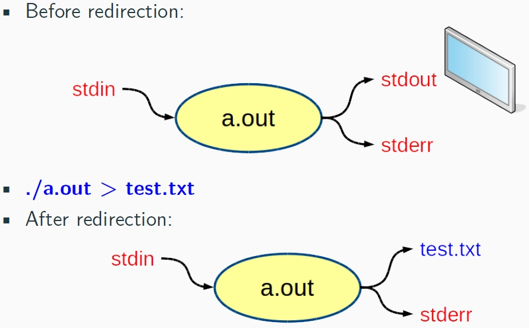
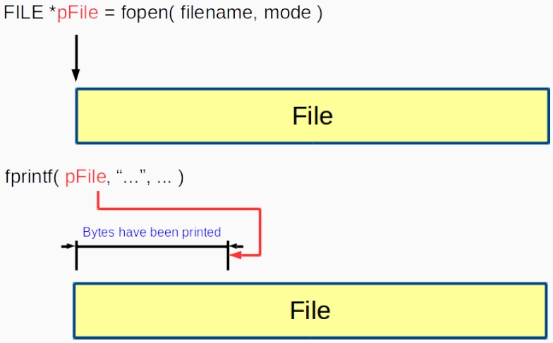

# File
- C 將每個檔案視為一個連續的 bytes stream
- 每個檔案以 `end-of-file` 為結尾，這是由系統提供而不是文件。

- It looks like there is an additional byte appended to the file. However, that additional byte does not exist. Instead, it is a signal raised by your system.
- `int feof(FILE *stream);`

## File Stream
- Streams 提供了更高級別的介面(interface)讓你存取資料。
    - `fprintf`
    - `fscanf`
- 事實上，你已經使用過 file stream !
    - 三種標準流
        1. 標準輸入 0 (standard input.)
        2. 標準輸出 1 (standard output.)
        3. 標準錯誤 2 (standard error.)
    - 真的嗎? 哪時候呀?
    - `scanf` -> scanf() 從標準輸入流中讀取輸入
    - `scanf` 的實作
        ```c
        int scanf(const char *fmt, ...){
            int count;
            va_list ap;
            va_start(ap, fmt);
            count = vfscanf(stdin, fmt, ap);
            va_end(ap);
            return(count);
        }
        ```
## File Descriptor
- File descriptor 為輸出入的操作提供了原始的低級介面(interface)。
- 在 Linux 中，任何東西都可以被視為一個檔案。
    - Network socker
    - Device driver
    - Inter-process communication
- 支援哪些操作?
    - `open`、`read`、`write`、`close`
- 如果要控制某些詳細的設定，你需要使用 file descriptor 而不是 file stream。
### File Stream vs. File Descriptor
- Structure:
    - Stream: `FILE *`
    - Descriptor: `int`
- 可以用 file stream 實現的，就一定可以用 file descriptor 實現，其逆不真。
- File streams 有更多方便的介面(interface)給你使用。

## I/O Redirection
### stdout

- `>` filename
    - 重導向 stdout 到一個檔案
    - 如果檔案不存在就創建文件，否則就將其覆蓋
- `>>` filename
    - 重導向 stdout 到一個檔案
    - 如果檔案不存在就創建文件，否則就加在後方
---
- `>` filename
- `1>` filename
    - Redirect stdout to file "filename"
- `>>` filename
- `1>>` filename
    - Redirect and append stdout to file "filename"
- `2>` filename
    - Redirect stderr to file ”filename.”
- `2>>` filename
    - Redirect and append stderr to file ”filename.”
- `&>` filename
    - Redirect stdout, stderr to file ”filename.”
### stdin
`$ . / abs < number.txt`

# Text File Processing
### fopen
`FILE *fopen(const char *path, const char *mode);`
- path：檔案路徑
- mode：
    - `r`：read
    - `w`：write
    - `a`：append
    - 更多的選項在手冊中
- Return：`FILE *`
    - 成功的話，FILE pointer 將被回傳
    - 如果失敗的話，將回傳 NULL 並且 errno 被設置為表明 error
    - 永遠記得確認回傳的 pointer!
### fprintf
- 幾乎和`printf`相同，除了你需要給 FILE stream pointer。
### End-of-File Indicator
- Linu/Mac OS X/UNIX：`<Ctrl> d`
- Windows：`<Ctrl> z + enter`
### fclose
`int fclose(FILE *stream);`
- `fclose()`
- The fclose() function flushes the stream pointed to by stream (writing any buffered output data using fflush(3)) and closes the underlying file descriptor.
- 也就是說，當你 close 時，在 buffer 中的資料將被寫入檔案
- 在開檔後記得關上它!! 因為有同時開檔的數量上限。
### fscanf
- 操作就如同 `fprintf`
- 當然，檔案應該被以 `r` 的模式打開
---
- 當你使用 `fprintf` 或 `fscanf` 去處理文字檔時，它蘊含著你清楚地知道檔案的格式
- 在這些情況下，輸入的檢查也許就沒那麼重要了，對吧?
    - Yes：畢竟格式由你決定。
    - No：有些人可能會修改檔案，並使你讀取它。
## File Position Pointer

- 所以我們可以返回到開始的位置嗎??
    - 為什麼我們需要這麼做? -> 影片倒放
    - 當然，你可以關掉檔案並重開它。
    - 但我們有另外的函式可以幫助我們 -> `rewind`
### rewind
`void rewind(FILE *stream);`
- 將位置指回檔案的開頭。
- 那麼我們想要改變 file pointer 到任何地方呢? -> `fseek`
### fseek
`int fseek(FILE *stream, long offset, int whence);`
- The fseek() function sets the file position indicator for the stream pointed to by stream. The new position, measured in bytes, is obtained by adding offset bytes to the position specified by whence.
- `SEEK_SET`：檔案開頭
- `SEEK_CUR`：當前位置
- `SEEK_END`：end-of-file
---
- `rewind()` 相當於 `fseek(stream, 0L, SEEK_SET)`
### ftell
`long ftell(FILE *stream);`
- 告訴你當前所在的位置。

# Binary File Processing
## Binary File
- 文字檔以字元的方式儲存資料，然而並不是所有的檔案都是文字檔。例如，你可以用文字編輯器打開一張圖片。
- 此外文字檔的儲存效率並不高
    - 需要多少大小去儲存數字 123 ?
    - Text File：3 bytes
    - Binary File：1 byte
### fread
`size_t fread(void *ptr, size_t size, size_t nmemb, FILE *stream);`
- 從 FILE * 讀取 nmemb 個資料，每個 size bytes 長，並將它們儲存在 *ptr。
- 成功時回傳資料讀取的數量。如果失敗，或到達文件尾端時，則回傳是一短項計數 (或 0)
### fwrite
`size_t fwrite(const void *ptr, size_t size, size_t nmemb, FILE *stream);`
- 從 *ptr 讀取 nmemb 個資料，每個 size bytes 長，並將它們儲存在 FILE *。
- 成功時回傳資料寫入的數量。如果失敗，或到達文件尾端時，則回傳是一短項計數 (或 0)
## BMP File Format
- 這裡將使用 bmp 檔作為示範
    - 為什麼是 bmp 而不是 jpg ? -> 因為 bmp 是一種未被壓縮的照片格式。
- [連結](https://engineering.purdue.edu/ece264/17au/hw/HW15)
### 讀取 bmp 檔
- 讀取 bmp file header 並印出資訊
```c
#include <stdio.h>
#include <stdint.h>
#include <string.h>
#include <stdlib.h>

struct _sBmpHeader {
    char bm[2];
    uint32_t size;
    uint32_t reserve;
    uint32_t offset;
    uint32_t header_size;
    int32_t width;
    int32_t height;
    uint16_t planes;
    uint16_t bpp;
    uint32_t compression;
    uint32_t bitmap_size;
    int32_t hres;
    int32_t vres;
    uint32_t used;
    uint32_t important;
}__attribute__ ((__packed__));

typedef struct _sBmpHeader sBmpHeader;

void print_bmp_header( sBmpHeader *pHeader ) {
    printf( "ID: %c%c\n", pHeader -> bm[0], pHeader -> bm[1] );
    printf( "Size: %u\n", pHeader -> size );
    printf( "Reserve: %u\n", pHeader -> reserve );
    printf( "Offset: %u\n", pHeader -> offset );
    printf( "Header Size: %u\n", pHeader -> header_size );
    printf( "Width: %u\n", pHeader -> width );
    printf( "Height: %u\n", pHeader -> height );
    printf( "Planes: %u\n", pHeader -> planes );
    printf( "Bits Per Pixel: %u\n", pHeader -> bpp );
    printf( "Compression: %u\n", pHeader -> compression );
    printf( "Bitmap Data Size: %u\n", pHeader -> bitmap_size );
    printf( "H-Resolution: %u\n", pHeader -> hres );
    printf( "V-Resolution: %u\n", pHeader -> vres );
    printf( "Used Colors: %u\n", pHeader -> used );
    printf( "Important Colors: %u\n", pHeader -> important );
    return;
}

int main() {
    FILE *pFile = NULL;
    if((pFile = fopen("maldives_16.bmp", "rb")) == NULL) {
        printf("File could not be opened!\n");
        return 0;
    }
    sBmpHeader header;
    printf("%lu\n", sizeof(header));
    fread(&header, 54, 1, pFile);
    print_bmp_header(&header);                
    fclose(pFile);
    return 0;
}
```
### 修改 bmp 檔
- 翻轉顏色
```c
// ...略...
int main() {
    FILE *pFile = NULL;
    FILE *pFile2 = NULL;
    if((pFile = fopen("maldives.bmp", "rb")) == NULL) {
        printf( "File could not be opened!\n" );
        return 0;
    }
    if((pFile2 = fopen("maldives_gray.bmp", "wb")) == NULL) {
        printf("File could not be opened!\n");
        return 0;
    }
    sBmpHeader	header;
    fread( &header, sizeof( header ), 1, pFile );
    fwrite( &header, sizeof( header ), 1, pFile2 );
    while(!feof(pFile)) {
        uint8_t	original[1024] = {0};
        uint8_t modified[1024] = {0};
        size_t count = fread( original, 1, 1024, pFile );
        for(size_t i = 0; i < count; ++i){
            modified[i] = 255 - original[i];
        }
        fwrite( modified, count, 1, pFile2 );
    }
    fclose( pFile );
    fclose( pFile2 );
    return 0;
}
```
- 轉成灰階
```c
// ...略...
while(!feof(pFile)) {
    uint8_t	original[999] = {0};
    uint8_t modified[999] = {0};
    size_t count = fread( original, 1, 999, pFile );
    for(size_t i = 0; i < count; i = i + 3) {
        // BGR
        uint8_t gray = 0.299 * original[i+2] + 0.587 * original[i+1] + 0.114 * original[i];
        for(size_t j = 0; j < 3; ++j) {
            modified[i+j] = gray;
        }
    }
    fwrite(modified, count, 1, pFile2);    
}
// ...略...
```
---
#### Hex 編輯工具
- Bless Hex Editor
- GHex