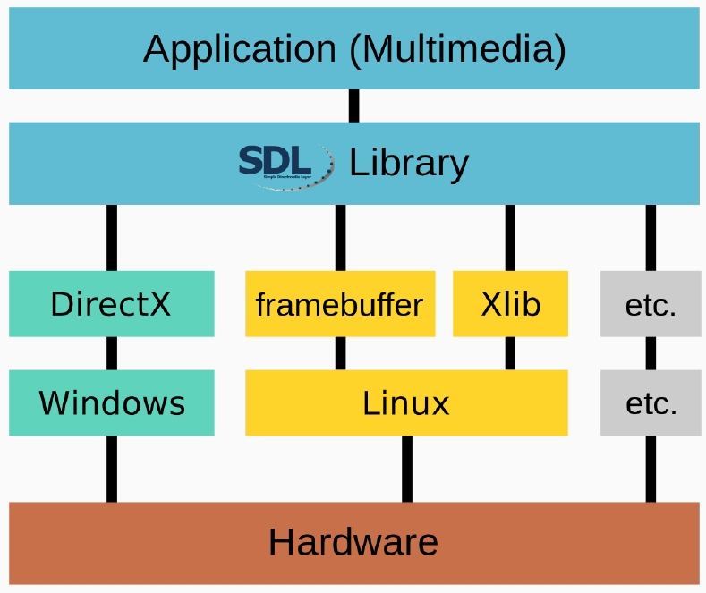

- 如何顯示 BMP 檔 ?
    - 有很多 libraries 可以幫助您做到這一點。實際上，您應該使用它們而不是從頭開始開發。
    - 如何在螢幕上顯示圖像？
        - 您必須至少學習一個 GUI 庫，例如 Gtk、Qt 等。
        - 我的建議：Qt。但是，這是一個 C++ 框架。
        - 了解如何使用 GUI 平台提供的功能顯示圖像。
---
# GTK
- GTK（以前稱為 GTK+、GIMP ToolKit）是一個免費的開源跨平台的部件工具箱 (widget toolkit)，用於創建圖形用戶界面（GUIs）。
- GTK 是用 C 語言所編寫的物件導向的部件工具箱。它使用 GObject（即 GLib 物件系統）進行物件導向。
    - 因此，不要告訴我 C 不能物件導向。
- 安裝：sudo apt install libgtk-3-dev
---
# SDL
- Simple DirectMedia Layer
- SDL是跨平台的軟件開發庫，為計算機多媒體硬件組件提供硬件抽象層。
    - 視頻
    - 聲音的
    - 輸入設備
    - 光盤
    - 螺紋
    - 共享對象加載
    - 聯網
    - 計時器
    - 3D圖形
- 軟體開發者可以使用它來編寫高性能的電腦遊戲和其他多媒體應用程式。
- SDL 架構 / 範例

 
- SDL Object
    - `SDL_Window`：包含有關 Window 本身的所有信息的結構：大小、位置、全螢幕、邊框等。
    - `SDL_Renderer`：處理所有渲染的結構。它與 `SDL_Window` 綁定在一起，因此只能在該 `SDL_Window` 中呈現。
    - `SDL_Textures` 和 `SDL_Surface`：`SDL_Renderer` 渲染`SDL_Texture`(存儲一個元素的像素資訊)。這是 `SDL_Surface` 的新版本，他們幾乎相同。
        - 重要的區別是 `SDL_Surface` 使用軟件渲染（通過CPU），而 `SDL_Texture` 使用硬件渲染（通過GPU）。
- 安裝：`sudo apt-get install libsdl2-dev libsdl2-image-dev`
- Makefile
    ```Makefile
    CFLAGS := `sdl2-config --libs --cflags` -ggdb3 -O0 --std=c99 -Wall -lSDL2_image -lm
    all: example.c
        gcc example.c -o example $(CFLAGS)
    clean:
        rm example
    ```
---
# File Descriptor
- POSIX C Implementation
    - C 標准定義了語法和標準庫，但不規範實現。
    - 所以在 Linux 中，fopen、fclose、printf、scanf、fprintf、fscanf、fread 和 fwrite 是通過低階 API 實現的：
        - open
        - read
        - write
        - close
    - 現在，我們將使用這些較低級別的 API 來訪問文件。
### open, close
`int open(const char *pathname, int flags);`
- Given a pathname for a file, open() returns a file descriptor, a small, nonnegative integer for use in subsequent system calls.
- open() returns the new file descriptor, or -1 if an error occurred.
- The argument flags must include one of the following access modes: `O_RDONLY`, `O_WRONLY`, or `O_RDWR`.
`int close(int fd);`
- close() closes a file descriptor, so that it no longer refers to any file and may be reused. close() returns zero on success. On error, -1 is returned, and errno is set appropriately.
- For more flags, please read manual.
### read, write
`ssize_t read(int fd, void *buf, size_t count);`
- read() attempts to read up to count bytes from file descriptor fd into the buffer starting at buf. On files that support seeking, the read operation commences at the current file offset, and the file offset is incremented by the number of bytes read. If the current file offset is at or past the end of file, no bytes are read, and read() returns zero.
`ssize_t write(int fd, const void *buf, size_t count);`
- write() writes up to count bytes from the buffer pointed buf to the file referred to by the file descriptor fd.
- How about seek? use `lseek`.
### fstat
`int fstat(int fd, struct stat *buf);`
- These functions return information about a file, in the buffer pointed to by buf.
# mmap


`void *mmap(void *addr, size_t length, int prot, int flags,int fd, off_t offset);`
- mmap() creates a new mapping in the virtual address space of the calling process. The starting address for the new mapping is specified in addr. The length argument specifies the length of the mapping.
- If addr is NULL, then the kernel chooses the address at which to create the mapping.
- 現在您可以將返回地址視為一個大陣列，您可以直接訪問數據，包括修改數值。
- 在使用 mmap 後，請記得要 `munmap`。
- `mmap()` 不是標準 C 的函式
- `MapViewOfFile` function is somewhat equivalent to mmap in Windows.
