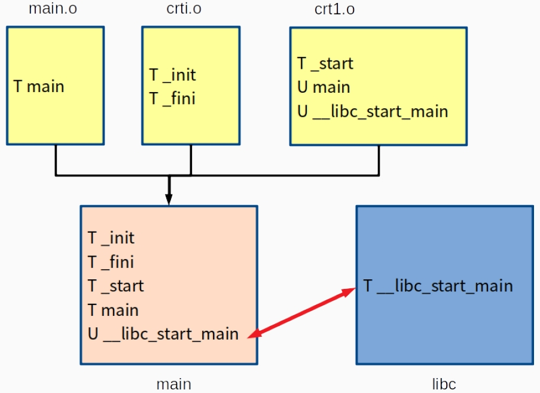

# Program Argument
### argc, argv
```c
#include <stdio.h>
#include <stdlib.h>
#include <stdint.h>
int main(int argc, char *argv[]) {
    printf("argc: %d\n", argc);
    for(int32_t i = 0 ; i < argc ; i++)
        printf("argv[%d]: %s\n", i, argv[i]);
    return 0;
}
```
- 誰呼叫了 main 函式?
- 誰提供了 `argc` 和 `argv` 到 main 函式?
- Is `main()` the actual starting entry point?
    - No! Actually, the process start from `_start` which is defined in `crt1.o`.
    - 等等... 我並沒有使用 `crt1.o` 呀!
    - 實際上是有的。請查看 `gcc -v`
    `$ nm /usr/lib/x86_64-linux-gnu/crt1.o`
- Simplified C Linking Process

- main() 是如何取得 argc, argv 的?
    - Actually, `_start` will prepare argc and argv first.
    - Then `_start` will register main function to `__libc_start_main`.
    - `_start` will call `__libc_start_main` and `__libc_start_main` will call main.
    - More details will be described in Assembly.
### getopt
`int getopt(int argc, char * const argv[], const char
*optstring);`
- The getopt() function parses the command-line arguments. Its arguments argc and argv are the argument count and array as passed to the main() function on program invocation. An element of argv that starts with ’-’ (and is not exactly ”-” or ”–”) is an option element. The characters of this element (aside from the initial ’-’) are option characters. If getopt() is called repeatedly, it returns successively each of the option characters from each of the option elements.
- 提醒：這是一個 `POSIX 標準`而不是 C 標準。
- extern 變數
    ```c
    extern char *optarg;
    extern int optind, opterr, optopt;
    ```
    - 這意味著我們可以在程式中使用這些變數。
```c
#include <stdio.h>
#include <stdlib.h>
#include <stdint.h>
#include <unistd.h>

int main(int argc, char *argv[]) {
    int32_t c = 0;
    while((c = getopt(argc, argv, "ab:")) != -1) {
        switch(c) {
            case 'a':
                printf( "option: -a\n" );
                break;
            case 'b':
                printf( "option: -b, %s\n", optarg );
            case '?':
                printf( "option: ?\n" );
                break;
            default:
                printf( "option: unknown\n" ); 
                break;
        }
    }
    return 0;
}
```
- optstring
    - optstring 是一個包含合法選項字符的字符串。
    - Example: `"abc"` implies supporting `-a`, `-b`, `-c`.
    - `-ab`, `-bc`, `-ac`, `-abc` are also supported.
    - 如果這樣的字符後跟一個冒號，則意味著該選項需要一個參數。 `optarg` 為參數值。
- 回傳值
    - 如果成功找到選項，則 getopt() 回傳選項字符。
    - 如果所有命令行選項都已解析，則 getopt() 回傳 -1。
    - 如果 getopt() 遇到不在 optstring 中的選項字符，則返回 `'?'`。
    - 如果 getopt() 遇到缺少參數的選項，則返回值取決於 optstring 中的第一個字符：
        - 如果是`':'`，則返回`':'`；
        - 否則返回`'?'`。
### getopt_long
`int getopt_long(int argc, char * const argv[], const char *optstring, const struct option *longopts, int *longindex);`
- The getopt_long() function works like getopt() except that it also accepts long options, started with two dashes. If the program accepts only long options, then optstring should be specified as an empty string (””), not NULL. Long option names may be abbreviated if the abbreviation is unique or is an exact match for some defined option. A long option may take a parameter, of the form –arg=param or –arg param.
- If longindex is not NULL, it points to a variable which is set to the index of the long option relative to longopts.
- struct option 
    ```c
    struct option {
        const char *name;
        int has_arg;
        int *flag;
        int val;
    };
    ```
    - name: the name of the long option.
    - has_arg:
        - 0: no arguments.
        - 1: required arguments.
        - 2: optional arguments.
    - flag: specifies how results are returned for a long option.
    - val: the value to return, or to load into the variable pointed to by flag.
```c
#include <stdio.h>
#include <stdlib.h>
#include <stdint.h>
#include <unistd.h>
#include <getopt.h>

struct option long_options[] = {  
     {"all",  0, NULL, 'a'},
     {"break", 0, NULL, 'b'},
     {"cancel", 1, NULL, 'c'},
     {0, 0, 0, 0},
};

int main(int argc, char *argv[]) {
    int32_t c = 0, index = 0;
    while((c = getopt_long(argc, argv, "abc:", long_options, &index)) != -1) {
        printf("index: %d\n", index);
        switch(c) {
            case 'a':
                printf( "option: -a\n" );
                break;
            case 'b':
                printf( "option: -b\n" );
                break;
            case 'c':
                printf( "option: -c, %s\n", optarg );
                break;
            case '?':
                printf( "option: ?\n" );
                break;
            default:
                printf( "option: unknown\n" ); 
                break;
        }
    }
    return 0;
}
```
# Variable Length Arguments
- 可變長度參數是一項功能，允許函數接收任意數量的參數。
- 可變數量的參數由三個點表示 `...`。
```c
#include <stdarg.h>
void va_start(va_list ap, last);
type va_arg(va_list ap, type);
void va_end(va_list ap);
void va_copy(va_list dest, va_list src);
```
- Actually, they are macros instead of functions.
- 範例一： printargs.c
    ```c
    #include <stdio.h>
    #include <stdarg.h>
    #include <stdint.h>
    /* print all args one at a time until a negative argument is seen;
    all args are assumed to be of int type */
    void printargs(int32_t arg1, ...) {
        va_list ap;
        int32_t i;
        va_start( ap, arg1 ); 
        for(int32_t i = arg1; i >= 0; i = va_arg(ap, int32_t))
            printf( "%d ", i);
        va_end( ap );
        putchar('\n');
        return;
    }
    int main() {
        printargs(5, 2, 14, 84, 97, 15, -1, 48, -1);
        printargs(84, 51, -1);
        printargs(-1);
        printargs(1, -1);
        return 0;
    }
    ```
- 範例二： avg.c
    ```c
    #include <stdarg.h>
    #include <stdio.h>
    #include <stdint.h>
    double average(int32_t num, ...) {
        va_list valist;
        int32_t sum = 0;
        va_start(valist, num);
        for (int32_t i = 0; i < num; i++)
            sum += va_arg(valist, int32_t);
        va_end(valist);
        return sum / (double)num;
    }
    int main() {
        printf("Average of { 3, 4 } = %lf\n", average(2, 3, 4));
        printf("Average of { 5, 10, 15 } = %lf\n", average(3, 5, 10, 15));
        return 0;
    }
    ```
