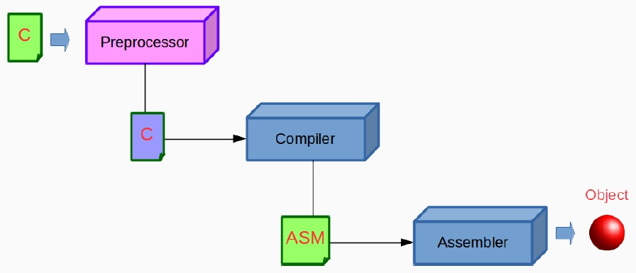

# Preprocessor 預處理器
- 在編譯器將您的源代碼編譯為組語前，還有一個稱為預處理的附加階段。
- Objective: Produce a source code file with preprocessing commands properly sorted out.

- Preprocessor commands are known as <font color=blue>Directives</font>.
- Preprocessor provides certain features, which are called <font color=blue>preprocessor directives</font>.
- Preprocessor directive 以 `#` 為開頭。(例如：`#include <stdio.h>`)
- Preprocessor directives 可以被放在程式中的任何地方。但建議放在開頭，並且每個必須獨立一行。
---
```c
#include <stdio.h>
#define MACRO_DEMO 123
int main() {
    printf("demo:␣%d\n", MACRO_DEMO);
    return 0;
}
```
- 以 `gcc -E main.c` 查看預處理後的狀態。
# Macro 巨集
- `#define` is known as <font color=blue>macro expansion</font>.
- General Form: `#define macro_template macro_expansion`
## Macro Expansion
- Preprocessor searches for macro definition.
- After finding macro definition, it searches the whole program for **macro_template**.
- <font color=red>Replace</font> every **macro_template** with **macro_expansion**.
    - Replacement will not occur if the template is in a quoted string.
- Notes:
    - 通常 macro_template 會使用<font color=blue>大寫字母</font>
    - 不要使用分號 `;`
---
- 為什麼要用巨集?
    - 為了寫出更高效率的程式。
    - 提高程式的可讀性。
    - 定義的巨集名稱可作為其他定義的一部分。
- 巨集可以像函式一樣擁有 arguments。
- Notes：
    - 在定義巨集時，參數和名稱之間不允許有空格。
    - Macro expansions 應該用括號括起來。
    - 使用 `\` 將巨集拆分為多行。
## Macro vs. Function
### Macro
- 單純替換
- 雖然你可能沒感覺，但比函式更快。
### Function
- 傳遞參數 -> 執行 -> 回傳結果
- 支援<font color=red>遞迴</font>
## inline Functions
- `inline` is a CPP keyword.
- C includes this keyword from C99. Though GNU C (and some other compilers) had inline functions long before standard C.
- Comparison:
    1. inline is just a suggestion.
    2. inline will check types.
- I will not talk too much about this keyword since it is different from CPP. I do not want to mislead you.
- If you are interested in this topic, please read [here](http://www.greenend.org.uk/rjk/tech/inline.html).

# File Inclusion
- Why File Inclusion?
    - Divide a program in multiple files.
        - Each file contains related functions.
        - How to classify functions. Up to you.
    - Some functions or macros are required in lot of programs.
        - Put them in a file. Make them a library.
        - Include them when you need them.
- What does Inclusion Mean?
    - Nothing but simply <font color=blue>copy and paste</font>.
    - <font color=blue>Nested Inclusion</font> is supported.
# Conditional Compilation
- Write one code to run on different environments.
    - `#if`: if.
    - `#else`: else.
    - `#elif`: else if.
    - `#endif`: end if.
    - `#ifdef`: if defined.
    - `#ifndef`: if not defined.
### ifdef and endif
```c
#ifdef macroname
    statement sequence.
#endif
```
- 如果 macroname 被定義了，那麼 `#ifdef` 和 `#endif` 之間的程式將被執行。
- 範例：
    ```c
    #ifndef TEST_H
    #define TEST_H
    ...
    #endif
    ```
    - 但也可用 `#pragma once`
---
- `gcc -D OS_LINUX os_dependent.c`
- `-D`: Predefine name as a macro, with definition 1.
- So one code can be executed on different OSs. What you need to do is to build your code with different definitions.
- This is a very useful technique. Let’s see a real case ([cJSON](https://github.com/DaveGamble/cJSON/blob/master/cJSON.h)).
---
- 請自行去了解 `#` 及 `##` 在巨集中的作用。