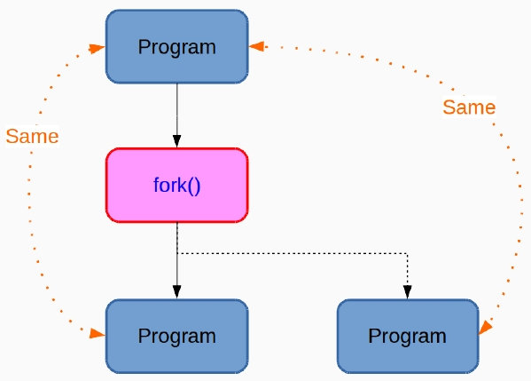

# Predefined Macros
## Standard Predefined Macros
```c
#include <stdio.h>
int main() {
    printf("line: %d \n", __LINE__);
    printf("file: %s \n", __FILE__);
    printf("function: %s \n", __FUNCTION__); // gcc
    printf("function: %s \n", __func__); // C99
    printf("time: %s \n", __TIME__);
    printf("date: %s \n", __DATE__);
    printf("STDC: %d \n", __STDC__);
    printf("STDC_VERSION: %ld \n", __STDC_VERSION__);
    printf("TIMESTAMP: %s \n", __TIMESTAMP__);
    return 0;
}
```
- 我們可以怎麼使用這些 Macros ?
    - `fprintf(stderr, "Internal␣error: at %s, line %d. ver %s %s", __FILE__, __LINE__, __DATE__, __TIME__);`
    - Define when Compiling
        - `gcc -D__DEBUG__ debug.c`
        ```c
        #include <stdio.h>
        int main() {
            printf("Hello World!!\n");
        #ifdef __DEBUG__
            printf("debug!!\n");
        #endif
            return 0;
        }
        ```
- Other GCC Predefined MACROs
    - [Common Predefined Macros](https://gcc.gnu.org/onlinedocs/cpp/Common-Predefined-Macros.html)
# Comparing Unsigned Integers
- When comparisons between signed and unsigned integers, C will force the signed type to unsigned.
- C99 and C11 section 6.3.1.8.
- It is hard to debug since it looks so nature.
# Call Functions at Program Termination
### atexit
`int atexit(void (*function)(void));`
- Register a Function to be Called at Normal Process Termination
- The atexit() function registers the given function to be called at normal process termination, either via exit(3) or via return from the program’s main(). Functions so registered are called in the reverse order of their registration; no arguments are passed.
- The atexit() function returns the value 0 if successful; otherwise it returns a nonzero value.
```c
#include <stdio.h>
#include <stdlib.h>
void foo(void) {
    printf("Goodbye Foo!\n");
}
void bar(void) {
    printf("Goodbye Bar!\n");
}
int main(int argc, wchar_t* argv[]) {
    atexit(bar);
    atexit(foo);
    return 0;
}
```
# system and more
### System: Execute a Shell Command
`int system(const char *command);`
- The system() library function uses fork(2) to create a child process that executes the shell command specified in command.
- system() returns after the command has been completed.
#### fork
- fork() creates a new process by duplicating the calling process.
- This is an important function. However, I will not talk too much about this function but you will learn more in System Programming.

---
- system() is a <font color=red>blocking</font> function.
    ```c
    #include <stdio.h>
    #include <stdlib.h>
    int main() {
        system("while true; do echo 'Hit CTRL+C'; sleep 1; done");
        return 0;
    }
    ```
- The system() returns `-1` means <font color=blue>your system cannot fork another process instead of your command fails.</font>
    - You can try a command to delete a non-existing file.
- Every system call is <font color=red>independent</font>.
    - So you cannot setup an environment variable and hope other other system calls use this variable.

### popen
`FILE *popen(const char *command, const char *type);`
- The popen() function opens a process by creating a pipe, forking, and invoking the shell.
- The popen() function returns NULL if the fork(2) or pipe(2) calls fail, or if it cannot allocate memory.
- 別忘了使用 `pclose`.
```c
#include <stdio.h>
#include <stdlib.h>
#include <stdint.h>
int main() {
    char        buffer[512];
    FILE        *pPing = NULL;
    uint32_t    counter = 0;
    pPing = popen("ping -c 4 www.google.com", "r");
    if(pPing == NULL) {
        printf("error end\n");
        exit(1);
    }
    while(fgets(buffer, 512, pPing)) {
        counter++;
        printf("--- %d ---\n", counter);
        printf("%s", buffer);
    }
    pclose(pPing);
    return 0;
}
```
# assert
- In computer programming, an assertion is a statement that a <font color=red>predicate</font> (Boolean-valued function, i.e. a true-false expression) is always true at that point in code execution.
- It can **help** a programmer read the code, help a compiler compile it, or help the program detect its own defects.
- If the assertion check is not in fact true, an assertion failure, <font color=blue>the program considers itself to be broken</font> and typically deliberately **crashes** or throws an assertion failure exception.
---
`void assert(scalar expression);`
- The macro assert() prints an error message to standard error and terminates the program by calling abort(3) if expression is false.
- The purpose of this macro is to help programmers find bugs in their programs.
```c
#include <stdio.h>
#include <assert.h>
int main() {
    FILE *fd;
    fd = fopen ("file.txt", "r");
    assert (fd);
    fclose (fd);
    return 0;
}
```
- 我可以簡單的使用 `if-else` 去確認並回傳值。那為什麼還要使用 `assert`?
    - 這取決於您是否可以優雅地處理錯誤。
- Note:
    - 一般來說，`assert` 被用在開發階段。
    - 當發佈時，請移除所有 `assert`。
# qsort
`void qsort(void *base, size_t nmemb, size_t size, int
(*compar)(const void *, const void *));`
- The qsort() function sorts an array with nmemb elements of size size. The base argument points to the start of the array.
- The comparison function must return an integer less than, equal to, or greater than zero if the first argument is considered to be respectively less than, equal to, or greater than the second. If two members compare as equal, their order in the sorted array is undefined.
```c
#include <stdio.h>
#include <stdlib.h>

int values[] = {88, 56, 100, 2, 25};
int cmpfunc (const void * a, const void * b) {
   return (*(int*)a - *(int*)b);
}
int main() {
    int n;
    printf("Before sorting the list is:");
    for(n = 0 ; n < 5; n++)
        printf("%d ", values[n]);
    qsort(values, 5, sizeof(int), cmpfunc);
    printf("After sorting the list is:");
    for( n = 0 ; n < 5; n++ )
        printf("%d ", values[n]);
    return 0;
}
```
# libcurl
- 安裝: `sudo apt-get install libcurl4 libcurl4-openssl-dev`
- 使用: [Example codes](https://curl.se/libcurl/c/example.html)
- 編譯: `gcc -I curl-7.63.0/include -L curl-7.63.0/lib/.libs/ opendata.c -lcurl` (需依照情況自行修改)
    - Makefile: 
        ```makefile
        CFLAGS = -O3 -Wall
        INCLUDE = -I curl-7.63.0/include
        LIB = -L curl-7.63.0/lib/.libs/
        all: opendata.c
            gcc ${CFLAGS} ${INCLUDE} ${LIB} opendata.c -o opendata -lcurl
        clean:
            rm -f opendata
        ```