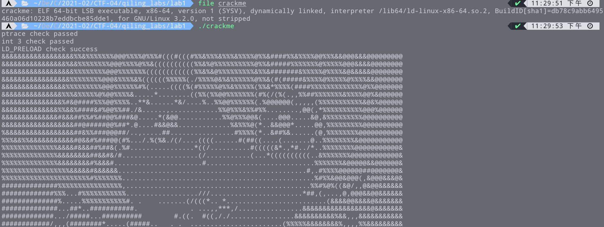
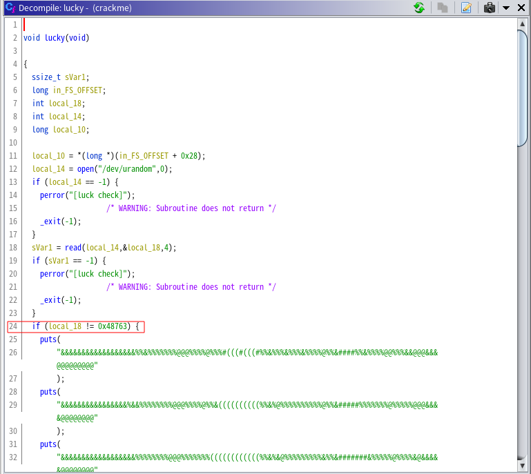
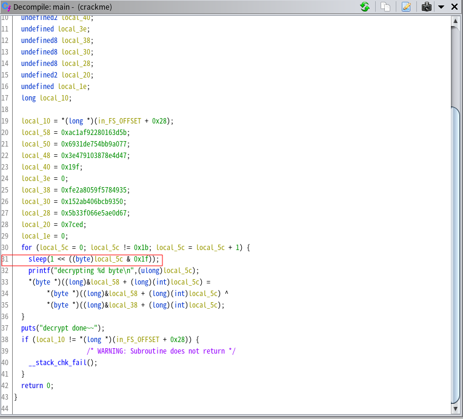
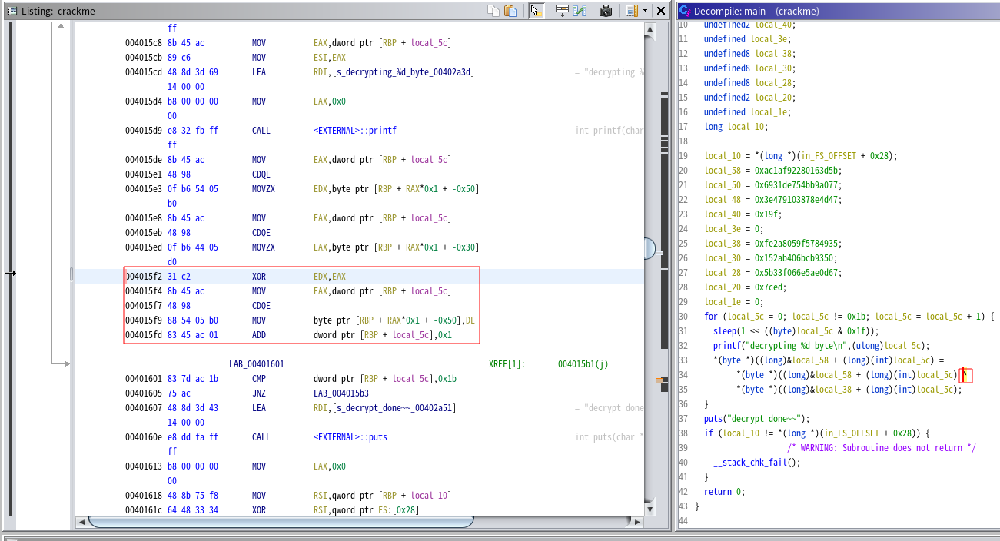

# 簡介
- 活動：2022/03/07 CTF 讀書會
- 講師：asef18766 陳兆閔

# 相關資源
- [Qiling](https://github.com/qilingframework/qiling)
- [rootfs](https://github.com/qilingframework/rootfs)
- [Qiling hijack](https://docs.qiling.io/en/latest/hijack/)
- [Qiling hook](https://docs.qiling.io/en/latest/hook/)

# Lab1
## Lab1 解題過程
1. 先 `file` 以及 `執行` 看看
    
2. 丟 ghidra 後，可以發現在 `lucky` 裡面有那張 ascii art ，而且其中第 24 行 `if(local_18 != 0x48763)` 是我們第一個要繞過得部份。
    
    ```python
    from qiling import *
    from qiling.os.mapper import QlFsMappedObject

    class Fake_urandom(QlFsMappedObject):
        def read(self, size):
            return 0x48763.to_bytes(4, "little") 

    if __name__ == "__main__":
        ql = Qiling(["./crackme"], "../../rootfs/x8664_linux")
        ql.add_fs_mapper("/dev/urandom", Fake_urandom())
        ql.run()
    ```
3. 之後執行 script 時會發現跑得很慢，觀察到 `main` 裡面有 `sleep` ，因此我們也將其繞過。
    
    ```python
    from qiling import *
    from qiling.os.const import STRING

    def my_sleep(ql):
        pass

    if __name__ == "__main__":
        ql = Qiling(["./crackme"], "../../rootfs/x8664_linux")
        ql.os.set_api('sleep', my_sleep, QL_INTERCEPT.CALL)
        ql.run()
    ```
4. 最後會發現 `flag` 的 decrypt 是在做 `xor` 並暫存在 `dl` 中，所以取出它並組成字串就得到 flag 了。
    
    ```python
    flag = ''

    def my_hook(ql: Qiling):
        global flag
        flag += chr(ql.reg.edx & 0xff)

    if __name__ == "__main__":
        ql = Qiling(["./crackme"], "../../rootfs/x8664_linux")
        ql.hook_address(my_hook, 0x004015f4)
        ql.run()
        print(flag)
    ```
## Lab1 完整 Script
```python
from qiling import *
from qiling.os.mapper import QlFsMappedObject
from qiling.const import *
from qiling.os.const import STRING

flag = ''

class Fake_urandom(QlFsMappedObject):
    def read(self, size):
        return 0x48763.to_bytes(4, "little") # fixed value for reading /dev/urandom

def my_sleep(ql):
    pass

def my_hook(ql: Qiling):
    global flag
    flag += chr(ql.reg.edx & 0xff)

if __name__ == "__main__":
    ql = Qiling(["./crackme"], "../../rootfs/x8664_linux")
    ql.add_fs_mapper("/dev/urandom", Fake_urandom())
    ql.os.set_api('sleep', my_sleep, QL_INTERCEPT.CALL)
    ql.hook_address(my_hook, 0x004015f4)
    ql.run()
    print(flag)
```
## Lab1 Flag
- flag：`ntnu{y0R'3r 5uch @ beater}`