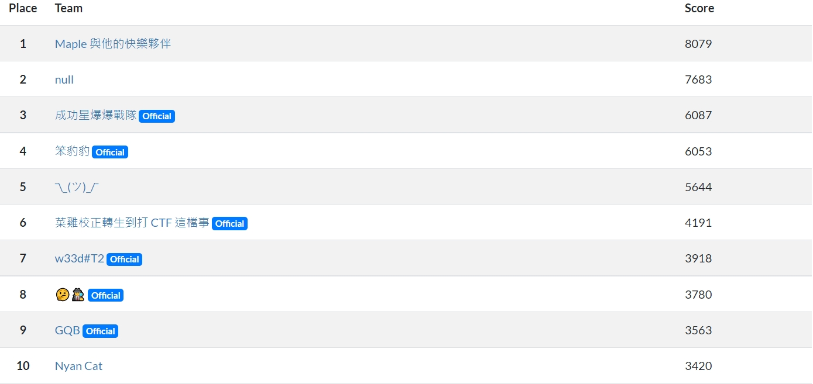
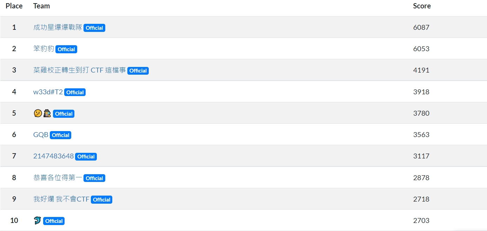

# 前情提要
&emsp;&emsp;一開始時，學長們在 Messenger 的群組裡問有沒有人要參加這場新手向的 CTF 競賽，我是沒有選擇參加的 (因為我從來沒有深入的去玩、學習這方面的東東，可以算是個純正的小萌新~~)，然而到最後因為人數的關係學長們組成了兩隊，然後還能再多 2 個人，因此我也加入想說去見見世面也好。(其中還得感謝學長們的鼓勵，以及願意帶我這個什麼都不會的新手):laughing::laughing:

# 競賽簡介
- [R2S CTF](https://ctf.r2s.tw/)
- [競賽網站](https://quals.r2s.tw/)
- Online Qualification : 7/16 - 18
- Flag 樣式：`R2S{}`

# 成績
- All: 7 / 81
- Offical Only: 4 / 43

 

# 解題紀錄
- 以下是我解的題目，其他題目我無能為力，就只能看有沒有學長寫題解了(顆顆
### Welcome
- Welcome to R2S CTF o((>ω< ))o
    - 在 R2S Discord 群組中的 challenge-announcement 頻道中，有黑黑的訊息要點開就能到 Flag 了。
    - 一開始覺得很酷，事後知道了這叫暴雷標籤 `||暴雷訊息||`。
### Forensics
- Headache
    - 這題依照 CRC32 找出圖片的長寬，並用 hex editor 把 png 的 header 改成正確的就行了。
### Crypto
- Base1024
    - 這題將那堆 emoji 解碼後就得到 Flag 了。
    - [ecoji](https://github.com/keith-turner/ecoji)、[ecoji 線上工具](https://ecoji.io/)
- BiGGG_RSA
    - 一開始不知道怎麼分解 N，對於 [Factordb](http://factordb.com/) 來說也太大了，解不出來。之後到了這個 [primefac-fork](https://github.com/elliptic-shiho/primefac-fork)，再寫個簡單的程式就解決了。
- Seeeeed
    - 也是 RSA 相關題。
### Misc
- Time Traveler
    - `nc time-traveler.misc.quals.r2s.tw 5487`
    - 依照格式輸入並計算一下，弄到 1937 年就有 Flag 了。
- Fat7z
    - 依照給的 code 反著寫，就能得到 Flag 了。
### Reverse
- What is this!?
    - JavaSript aaencode
    - 將言文字轉回 js，再執行裡面的 function 就行了。
### Web
- Chatroom
    - [chatroom](https://chat.web.quals.r2s.tw/)
    - 一樣是 JavaSript aaencode
    - 複製下來，F12 丟 console，Flag 就噴出來了。

# 心得
&emsp;&emsp;這次是我第一次參加 CTF 相關的競賽，雖然幾乎都不太會寫，主要的題目還都是學長們解開的，但這場比賽中我依然學到了不少新的技巧，也對 CTF 有了更多的興趣，未來繼續努力吧!