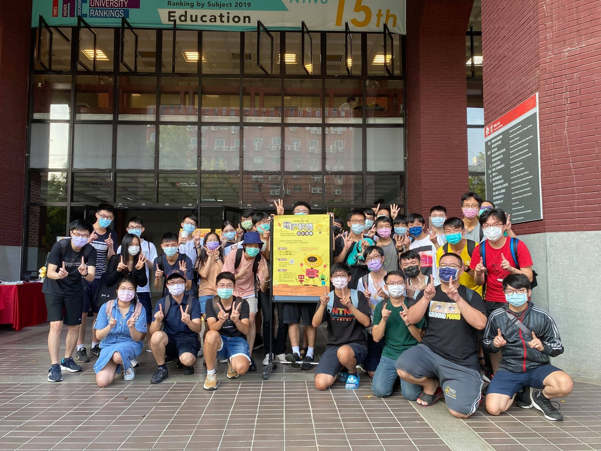

# 競賽簡介
- [NCPC](https://ncpc.nsysu.edu.tw/)
- 初賽日期：2021/10/02

# 成績
- 校內：7 / 12
- 全體：26 / 166

# 心得文

- 這段時間真的有點忙過頭了
    1. 安排 CTF 讀書會的課表（嘿嘿，還去跟 L紀 教授要到了一堂課，希望到時他不會有突發的事情，而是能正常的出席講課），也跟學長一起參加了社團幹部培訓的研習。
    2. 協助以前的高中辦理了學科能力競賽的校內初賽，不只從報名簡章到表單，還有競賽的平台以及題目，這裡要特別的感謝一起陪我瘋狂的朋朋 [蘇子權](https://kutsunasubarya.github.io/)，但不得不說，學弟們還得多多加油呀，有機會、時間的話再回去辦研習課程吧！
    3. 我要小小的抱怨一下，學校的選課系統
        - 到底要多久才有機會看到它更新？(有時間去弄那一點都不友善的手機版，不如去重構整個系統。)
        - 不要再人工分流了，很智障。
        - 好好做防 Bot 不行嗎？用那讓人很無言的驗證碼設計，整個傻眼。（打英文還會比打數字的多打幾個字）
        - 系統分發的部份，到底為什麼要那麼久才公佈，又不是用上古年代的電腦，有內幕嗎？（求八卦
        - 二階選課以前是不是直接搶課的呀，教程一階生，最高能選 6 學分，但用志願分發的，但志願只能填到 6 學分，這樣根本分不到呀，傻眼～～
        - 最重要的是，我第一個選課，比我晚搶課的同學都一一搶到（他們在不同的 server 上，就智障的人工分流問題），我卻只能看你寫登記中，然後慢慢等，直到最後跟我說滿額，是想怎樣啦 :rage::rage: ，但感謝身旁的朋朋們願意跟我一起去修早八的課程（把大學念到變高中）。
        - 我真的變學分孤兒了:sob::sob:
    4. 終於搶到疫苗了，但週日回臺南，禮拜一打疫苗，禮拜三一退燒就又重回北部，週六又打 NCPC 的初賽，整個瘋了～～

- 終於要來認真打該有的心得文了，這次的競賽我們隊伍終於好不容易組成了（文元原本因為身心狀態問題沒有要打了），但到比賽的前一天，我們的子權朋朋卻腸胃炎(尷尬)，而文元本來就是被我們抓來一起玩的而已(畢竟他依然得吃葡萄口味的曼陀珠？)，而我前一晚也想到一堆不想去想的東西，也沒睡到特別好...唉，整個發芬（文元語，咦？
- 好啦，雖然這次又跟 NCPC 的決賽擦身而過，我是不是真的有萬年老二的命呀？（初賽校內取到第六名），但是這一次的競賽是真的打的非常的開心（賽前測機部份、沒有印表機以及點心除外），水題我依舊是穩穩的 1 try 就解掉費時也不長，其中有一題文元提出模運算，我想到如何搭配前綴和使用，就 AC 了，撒花（但有些隊伍有寫過一樣的題目了，所以非常的早就解出來了 QAQ)，有一題我的想法是對的了，但子權刻後半的部份時一個迴圈寫錯了，最後也有除錯除出來，棒棒的～～（這次有看的所有題目都有好好的解出來呢！）
- 整體來說，這次競賽讓我享受到了不只有緊張的氣氛，還有團隊解出題時的愉悅，所以雖然沒有進決賽一樣很可惜，但我們志在參與嘛（弱者的發言:sob::sob:），不久後的 TOPC 也得繼續加油呢！
# 後記
- 到底為什麼要在生日當天打比賽呢，生日不就應該好好的躺在床上耍廢到極致嗎？真是的。好啦，這邊也要感謝我家饅頭頭的生日禮物，雖然遲了一天，原因是卡片沒寫好，（咦～），但都是我喜歡的東西呢(有最可愛的小十，還有史萊姆)，太開心了吧！！我自己也送了自己不少東西（單純找理由買東西，誤///）其中有大小兩隻可愛的小十呦，開心～～
