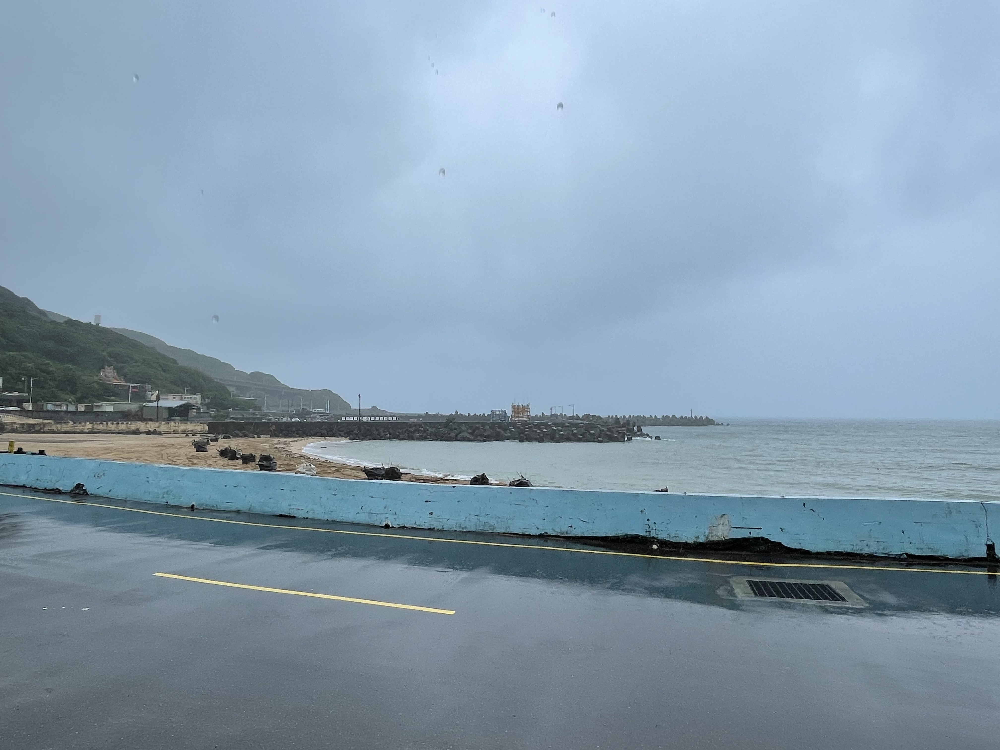
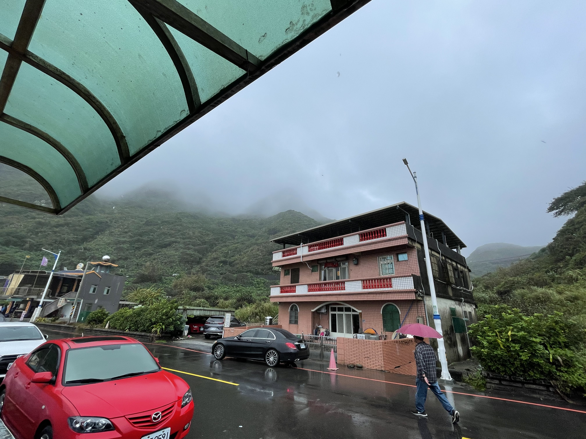
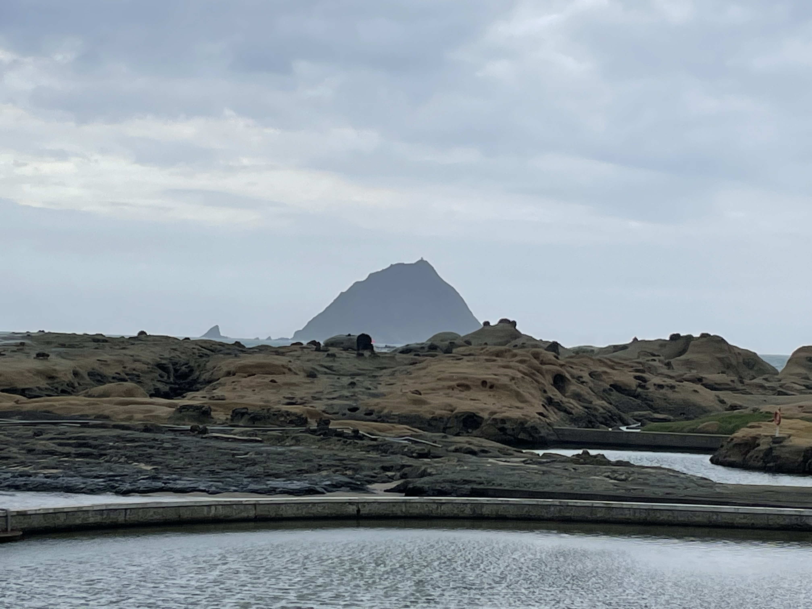
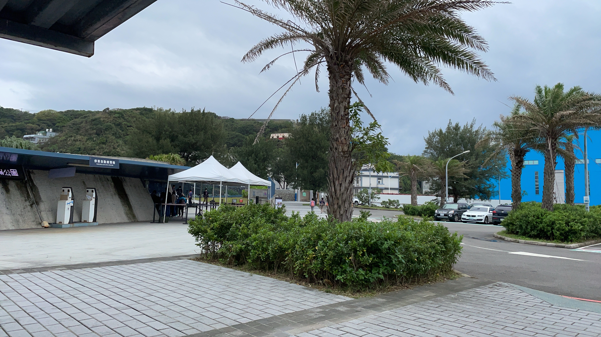
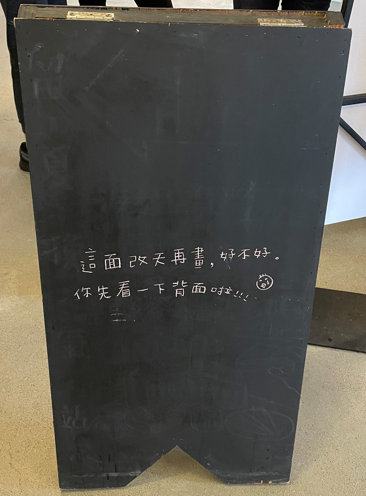
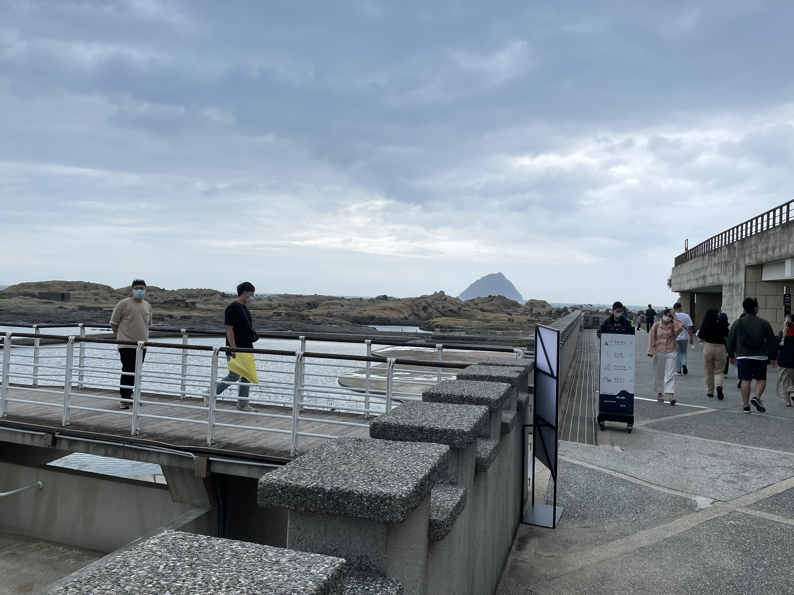
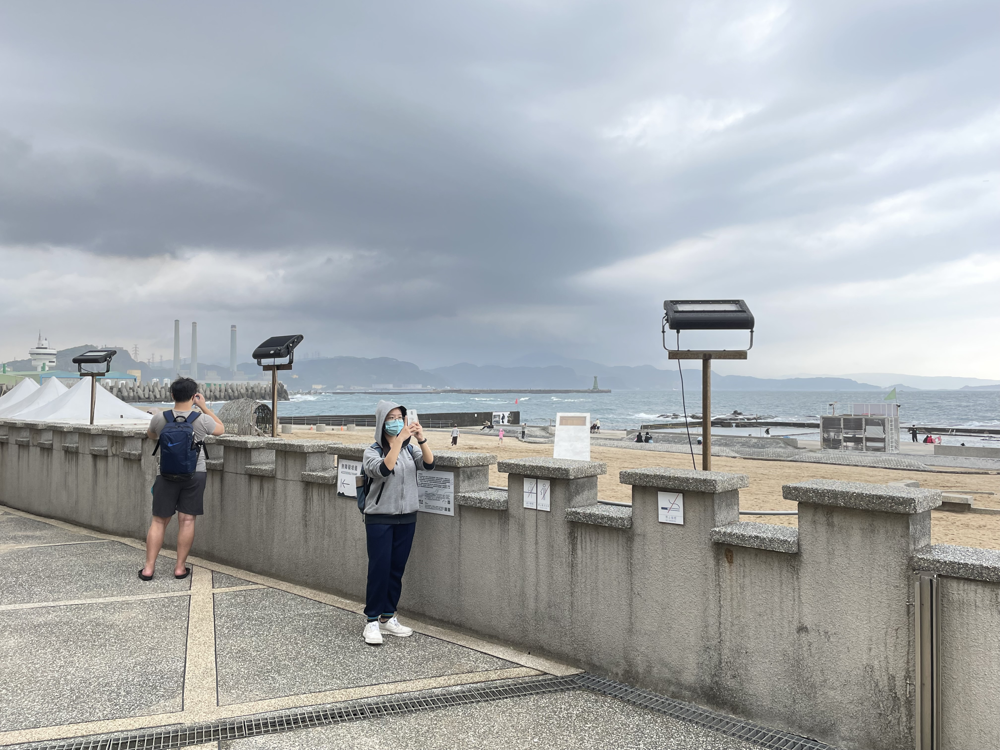
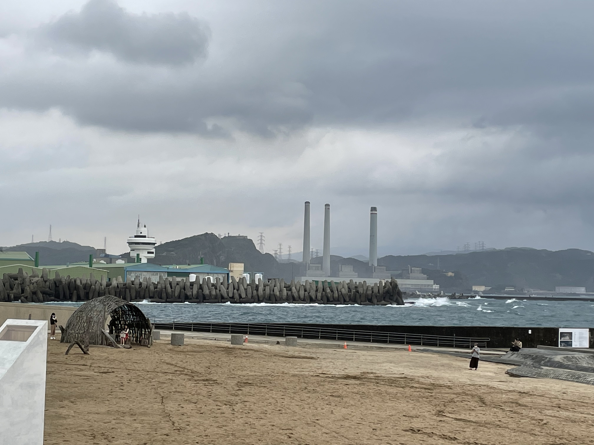
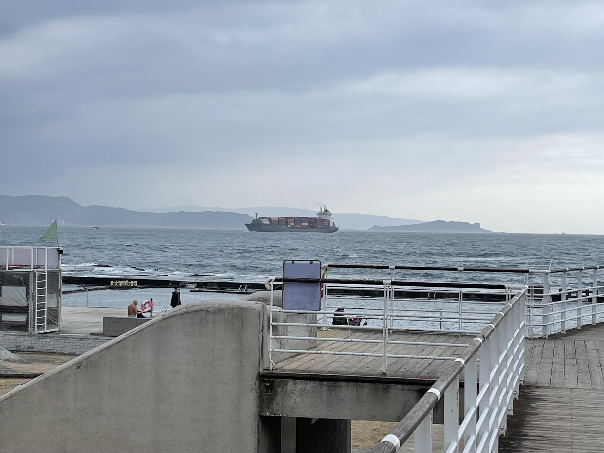

# 前情提要
&emsp;&emsp;因為在 5 月時疫情大爆發，然後臺灣也隨之進入了三級警戒的情況，所以暑假的資工營就因此而被取消舉辦了。

&emsp;&emsp;後來為了讓我們弄到一半的初階服務學習課程能繼續完成並拿到學分，因此最後變成了淨灘的活動。

# 活動簡介
- 第一次淨灘
    - 時間：2021/10/24 (日)
    - 地點：基隆大武崙澳底沙灘
- 第二次淨灘 
    - 時間：2021/11/20 (六)
    - 地點：基隆和平島公園

# 心得
## 第一次淨灘
&emsp;&emsp;因為地點在基隆海邊的緣故，所以就得特別的早就起床，然而一早起床後，就看到外面下著暴雨，因此心情就有那麼一點不美麗...當然也就少不了抱怨就是了。

&emsp;&emsp;然後輾轉了公車以及捷運，來到了臺北車站吃早餐，先去陪同學去全家買了輕便雨衣，然後我也順便買了杯咖啡，後來去便去麥當當吃了早餐，可惜地點不方便的緣故，就沒吃我最愛的鬆餅了 :cry::cry:

&emsp;&emsp;接著我們便搭火車前往基隆火車站，到站後因為人生地不熟的緣故，還在雨中找了公車站牌找了好一陣子，之後又因為不確定公車的方向與班次，還去問了遊客服務中心，好在於服務中心的人員熱情的協助之下，我們順利的抵達了活動地點。

&emsp;&emsp;只是因為時間還有些早的緣故，我們便在旁邊的熱炒店吃了一下午餐，雖然我大部分的海產類都沒有很愛吃就是了，顆顆；後來因為沙灘大部分的垃圾都已被處理過了的緣故，所以我們就用手撿了剩餘細小的塑膠碎片，這部分當下是真的有被震撼到就是了。

&emsp;&emsp;淨灘結束後的回程，我們先是爬了好一段山路才到公車站牌，其中看到了小小的瀑布或噴泉??(好啦，其實是下大雨然後山壁的流水而已啦)途中也看到了路邊有著大大小小的落石，感覺蠻危險的(怕///)，之後到了公車站牌，我們便去看路線的方向，而當我們看半天時，有一位好心的大媽就直接告訴我們是在對面，然後到了對面，又準備看路線圖時，有一位大爺，直接告訴我們來的這班車就是了，因此我們也順利的回到了北車，之後還順路逛了一下地下街才回學校。

&emsp;&emsp;補充：這一整天穿著一雙濕球鞋，還好回去沒有得香港腳，但也踩了濕濕的襪子走了不少的路，回去腳底整個痛爆 :cry::cry:

## 第二次淨灘
&emsp;&emsp;這一次也是跟上一次差不多的過程前往了基隆的和平島公園，唯一的不同就是沒有一早就下雨，這點對心情的影響真的蠻大的 :smile::smile:。之後在等待集合的過程中，在附近走走逛逛，還看到了超大艘的貨輪出海，嘿嘿。

&emsp;&emsp;然後，這次淨灘地過程還蠻歡樂的，但也撿了不少保麗龍、浮標、以及寶特瓶之類的物品，而且還撿到了不知誰用過的假 X (算是一種玩具?)，這些東西真的不要再亂丟了呀，唉...

&emsp;&emsp;結束的時候也剛好開始下雨，便在雨中拍了一下附近美麗的風景後，我們就用手機叫計程車前往下一個行程了...詳情可以查看 [九份、金瓜石二日遊](../experience-04/)

## 後記
&emsp;&emsp;其實說實話一開始準備幾乎都完成的資工營被取消變成淨灘活動時，心裡是有那麼一點不開心的，但是後來在經歷淨灘以及相關的課程後，我是覺得蠻棒的，畢竟不只對我們周遭的環境盡了一部分的心力外，也學習到了不少環保的相關知識。

&emsp;&emsp;最後也要感謝這一次陪我一起行動的 饅頭頭 和 壯壯權，以及途中給予我們許多幫助的人們，再次感謝還好有你們!!