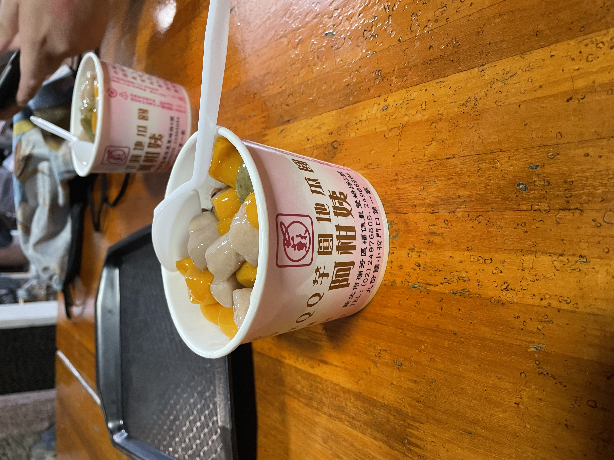
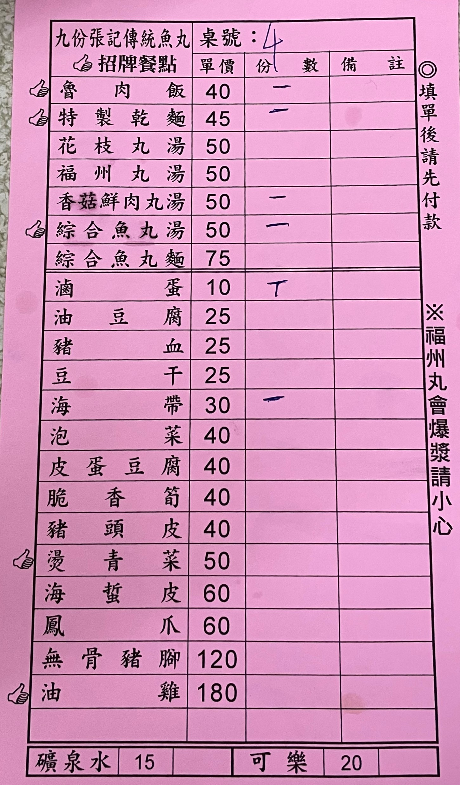

# 前情提要
&emsp;&emsp;由於資工營變成了[淨灘活動](../experience-03/)，然後地點又在基隆的海邊，想說既然都到那麼~~偏僻~~的地方了，又剛好跟朋友都有抽到國旅券，那麼就乾脆一起去玩一下吧！

# 活動簡介
- 時間：2021/11/20 ~ 2021/11/21
- 地點：九份、金瓜石

# 心得
## 第一天
&emsp;&emsp;淨灘後我們就搭著計程車前往瑞芳火車站，到達地點之後，我們在 壯壯權 的帶領下，去吃了許多的小吃，我吃了煎餃（還不錯吃，外皮相當的酥脆），而他們去吃牛肉湯麵，之後又去買了超大杯的飲料，而我點了仙草鮮奶茶（仙草茶 + 鮮奶的概念）...之後就走去搭公車前往九份的民宿了，但在這途中還看到了一間建築奇妙的圖書館（新北市立圖書館瑞芳分館），他的一樓是一個空曠的區域，而不直接是門口...

&emsp;&emsp;民宿的部分我們是住在 [琚九屋民宿](https://ninebb.mmweb.tw/)，原因不外乎就是當初訂的時候看起來還不錯，然後也不到太貴，外加當日還有空房...等因素，而實際的情況我個人是覺得也還蠻不錯的就是了。

&emsp;&emsp;放完行李之後，我們去逛了一下老街，還配著漂亮的夜景，吃著芋圓冰，之後回程逛逛時，還買了草仔粿吃，之後便回民宿休息了，畢竟淨灘後大家也都蠻累的了。（雖然，半夜還跟饅頭頭去 7-11 買了宵夜來吃，哈哈）

## 第二天
&emsp;&emsp;一早起床後，去找 壯壯權 時，才發現他竟然已經叫了外送的早餐吃了，還說這裡山上都沒有店家，還是從山下叫上來的，:joy::joy:，之後退完房間，我們去老街找早午餐吃，途中 饅頭頭（~~大胖胖~~） 還買了一份油蔥粿吃，吃飽喝足且看完風景後，我們就出發前往 [黃金博物館](https://www.gep.ntpc.gov.tw/)，這裡我們除了逛逛外，還買了淘金體驗券，玩了一把金沙呢！

&emsp;&emsp;離開博物館之後，在 壯壯權 的帶領下，去吃了份蠻不錯的炒飯後，還去爬了一下山路，途中經過了 壯壯權 的母校（~~監獄~~）時雨高中，還經過了 祈堂老街 ，最終到了 金瓜石勸濟堂 搭公車回去瑞芳火車站，而搭台鐵回到北車後，饅頭頭 又不受控的轉了扭蛋，哈哈。

# 後記
&emsp;&emsp;隔天禮拜一的下午竟然要考 資料結構 的期中考，我們完全的裸考，哈哈，還好考完的結果沒有爆掉，可喜可賀呀！:smile::smile:

&emsp;&emsp;最後依然要感謝這群願意陪我瘋、陪我玩的朋朋們。

# 照片牆

