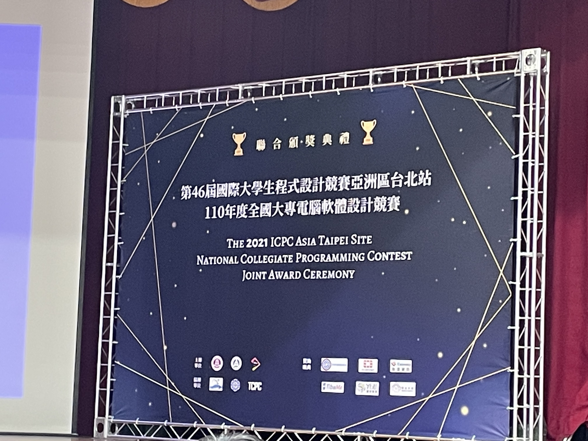

# 競賽簡介
- [ICPC 2021](https://icpc2021.ntub.edu.tw/)
- 日期：2021/11/27 ~ 2021/11/29
- 地點：國立台北商業大學

# 成績
- 解題數：3
- 校內：6 / 8
- 全體：68 / 103

# 心得

## 第一天
&emsp;&emsp;因為這一次又是在台北商業大學比賽，所以算是比較熟門熟路了，然後第一天是中午左右才開幕，因此我們就相約去吃了麥，善導寺捷運站旁這間麥當當還蠻大間的呢~~而這段期間有那個振興優惠的套餐，再配合甜心卡的威力，我們就獲得了一堆的薯條，:joy::joy:。

&emsp;&emsp;吃飽後當然就是去賽場報到 $\rArr$ 領衣服 $\rArr$ 換衣服 $\rArr$ 拍照 $\rArr$ 上樓進會場 $\rArr$ 開幕 $\rArr$ 講解規則及注意事項...，之後就是測機，然後放東西給檢查，離場。

- 補充：
    - 這一次我們名單的海報終於沒在地板上了，顆顆
    - 然後今年的衣服跟去年幾乎一樣呀，傻眼眼
    - 第一天當然是給餐盒呀，然後給一些餅乾在測機時吃~~

## 第二天
&emsp;&emsp;這一天一早就要集合比賽，所以蠻早就得出門了，累呀（攤...，早餐不外乎就是跑去吃永和豆漿呀，真的還算不錯，買一籠湯包還送奶茶，（但湯包份量不大，還得加點就是了）。之後跟 壯壯權 在北商裡等 文元 出現，而後就是去報到，領行李牌 $\rArr$ 放行李 $\rArr$ 進考場，然後在主考官說開始動前，都不能動桌面上的任何東西，我的小十呀!!!

&emsp;&emsp;這裡有個小插曲，就是我突然發現我們桌上沒看到我們這組的 CodeBook ，竟然是因為頁碼的問題被收走全部，還好有發現，加上有爭取，所以還是有拿回其中一份，雖然比賽都沒用到就是了，:smile::smile:

&emsp;&emsp;這次比賽的情況來說，整隊的解題氛圍還算蠻不錯了，我水題開的也依然又快又穩，但最後輸在第三題的時間花了有點久，我們的銅牌呀:cry::cry:，然後其中卡住的一題竟然是 數位 DP ，這真的沒有想到呀，還有一題是分析的時候太複雜化了，實際上沒那麼多情況要考慮呀，攤~~

&emsp;&emsp;比賽後拍拍照，我們就相約走去北車吃了小火鍋，算是自行舉辦的晚宴??之後在同學的陪同下，第一次從北車搭公車回公館去（平常都是搭捷運）

- 補充：
    - 這次因為疫情，比賽時候也沒有後面的餐點了，我的蛋糕、水果呀...
    - 比賽結束也沒有晚宴了，像去年露天流水席也還能接受嘛，到底為什麼要拿掉啦，:face_with_symbols_over_mouth::face_with_symbols_over_mouth:
    - 少了這麼多東西，報名費也沒變少呀!!!

# 後記
&emsp;&emsp;這一次系上經費似乎比較多的感覺，所以補助了一題 600 呢，開心 :smile::smile:

&emsp;&emsp;然後雖然這一次依然是萬年老二的狀態（跟得獎差一點點的意思），但也是有進步呢，就再繼續再接再勵吧，相信下一次獎牌就會到手了，加油~~

# 照片牆

