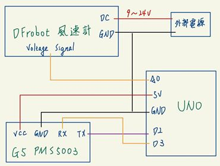

# 簡介
- 這系列主題將帶領大家建立一個簡易的氣象觀測站，而這一小節將製作由Arduino抓取感測器數值的部分。

# 硬體
- Arduino Uno R3 * 1
- 攀藤 G5 PMS5003 * 1
- DFrobot 三杯式風速感測器 * 1

# 教學開始
## 連結電路


## Uno程式碼
```cpp
#include <SoftwareSerial.h>
#define windPin A0
SoftwareSerial pmsSerial(2, 3);

long pmValue=0;
long pmcf25=0;
long pmat25=0;
unsigned int temperature = 0;
unsigned int humandity = 0;

void retrievepm25(){
    int count = 0;
    unsigned char c;
    unsigned char high;
    while (pmsSerial.available()) {
        c = pmsSerial.read();
        if((count==0 && c!=0x42) || (count==1 && c!=0x4d))
            break;
        if(count > 27)
            break;
        else if(count == 4 || count == 6 || count == 8 || count == 10 || count == 12 || count == 14 || count == 24 || count == 26)
            high = c;
        else if(count == 7){
            pmcf25 = 256*high + c;
            pmValue = pmcf25;
        }
        else if(count == 13){
            pmat25 = 256*high + c;
            pmValue = pmat25;
        }
        else if(count == 25)
            temperature = (256*high + c)/10;
        else if(count == 27)
            humandity = (256*high + c)/10;
        count++;
    }
    while(pmsSerial.available())
        pmsSerial.read();
}

void setup() {
    Serial.begin(9600);
    pmsSerial.begin(9600);
}

void loop() {
    retrievepm25();
    Serial.print(temperature);
    Serial.print(";");
    Serial.print(humandity);
    Serial.print(";");
    Serial.print(pmat25);

    int windValue = analogRead(windPin);
    int Level = 6 * windValue * (5.0 / 1023.0);
    Serial.print(";");
    Serial.print(Level);

    Serial.println();
    delay(1000);
}
```