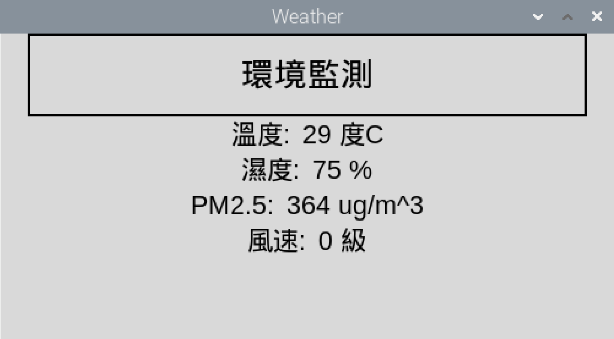

# 簡介
- 這系列主題將帶領大家建立一個簡易的氣象觀測站，而這一小節將製作在Raspberry pi用Python讀取Arduino Serial的數值，並且製作一個簡易的UI實時顯示出數值。
# 硬體
- 上一小節的成品
- Raspberry pi * 1
# 教學開始
1. 打開Raspberry pi的Terminal，並輸入 `ls /dev/tty*`
2. 將Arduino的Usb接上Raspberry pi
3. 再次於Terminal中輸入 `ls /dev/tty*`，比較兩次的差異，即可知Arduino使用的序列埠為何(例如此時為/ `dev/ttyACM0`，請依照情況自行修改)
4. 於Terminal中輸入 `python3 -m pip install pyserial`
5. 將以下程式碼建立成一個python檔，再以python3執行即可
```python
# -*- coding: UTF-8 -*-
import serial
import tkinter as tk

def getData():
    ser = serial.Serial('/dev/ttyACM0', 9600, timeout=1)
    ser.flush()
    while True:
        flag = False
        if ser.in_waiting>0:
            arduinoData = ser.readline().decode(encoding='utf-8', errors='ignore').rstrip().split(';')
            if len(arduinoData)!=4 or arduinoData=='':
                continue
            for i in range(0,3):
                if arduinoData[i]=='0':
                    flag = True
                    break
            if flag:
                continue
            else:
                temperature_value['text'] = arduinoData[0] + ' 度C'
                humidity_value['text'] = arduinoData[1] + ' %'
                pmat25_value['text'] = arduinoData[2] + ' ug/m^3'
                wind_value['text'] = arduinoData[3] + ' 級'
                break
    window.after(1000, getData)

if __name__=='__main__':
    window = tk.Tk()
    window.title('Weather')
    window.geometry('500x250')
    window.resizable(False, False)

    header_label = tk.Label(window, text='環境監測', font=('Arial', 20), width=30, height=2, borderwidth=2, relief='solid')
    header_label.pack(side=tk.TOP)

    temperature_frame = tk.Frame(window)
    temperature_frame.pack(side=tk.TOP)
    temperature_label = tk.Label(temperature_frame, text='溫度: ', font=('Arial', 16))
    temperature_label.pack(side=tk.LEFT)
    temperature_value = tk.Label(temperature_frame, font=('Arial', 16))
    temperature_value.pack(side=tk.LEFT)

    humidity_frame = tk.Frame(window)
    humidity_frame.pack(side=tk.TOP)
    humidity_label = tk.Label(humidity_frame, text='濕度: ', font=('Arial', 16))
    humidity_label.pack(side=tk.LEFT)
    humidity_value = tk.Label(humidity_frame, font=('Arial', 16))
    humidity_value.pack(side=tk.LEFT)

    pmat25_frame = tk.Frame(window)
    pmat25_frame.pack(side=tk.TOP)
    pmat25_label = tk.Label(pmat25_frame, text='PM2.5: ', font=('Arial', 16))
    pmat25_label.pack(side=tk.LEFT)
    pmat25_value = tk.Label(pmat25_frame, font=('Arial', 16))
    pmat25_value.pack(side=tk.LEFT)

    wind_frame = tk.Frame(window)
    wind_frame.pack(side=tk.TOP)
    wind_label = tk.Label(wind_frame, text='風速: ', font=('Arial', 16))
    wind_label.pack(side=tk.LEFT)
    wind_value = tk.Label(wind_frame, font=('Arial', 16))
    wind_value.pack(side=tk.LEFT)

    getData()
    window.mainloop()
```
- 最終成果圖
